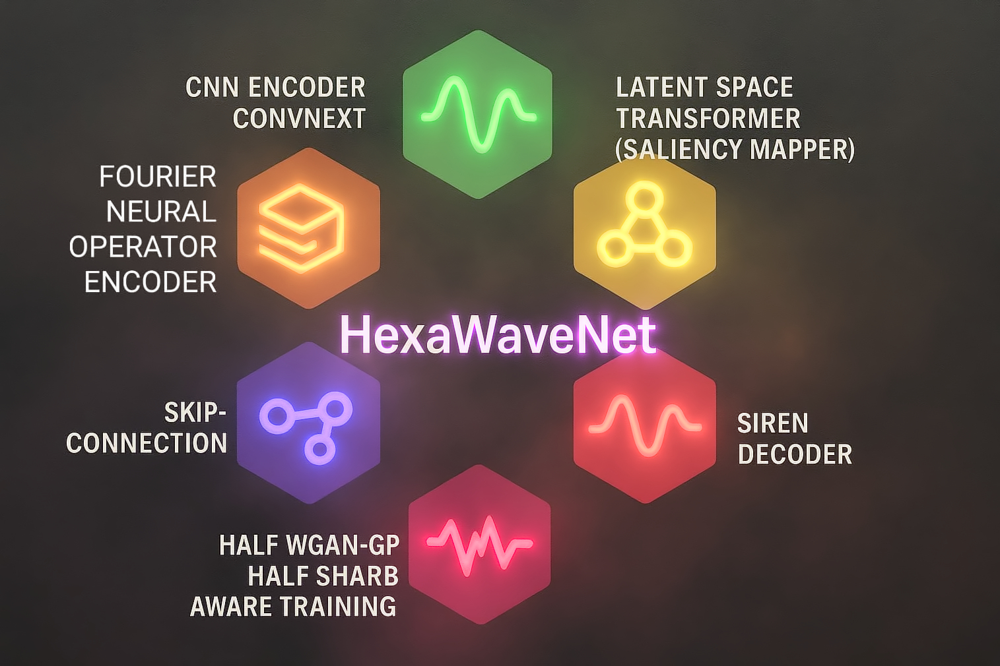
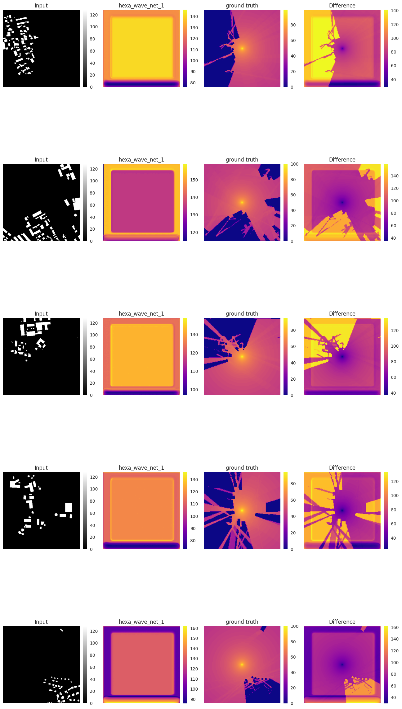
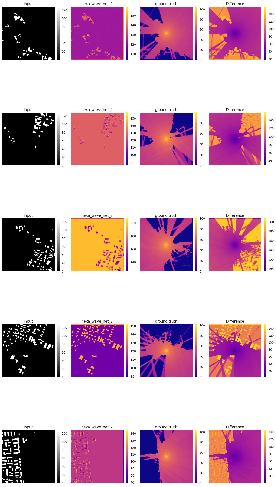
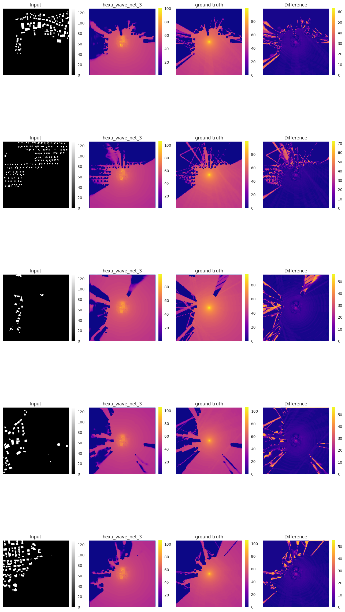
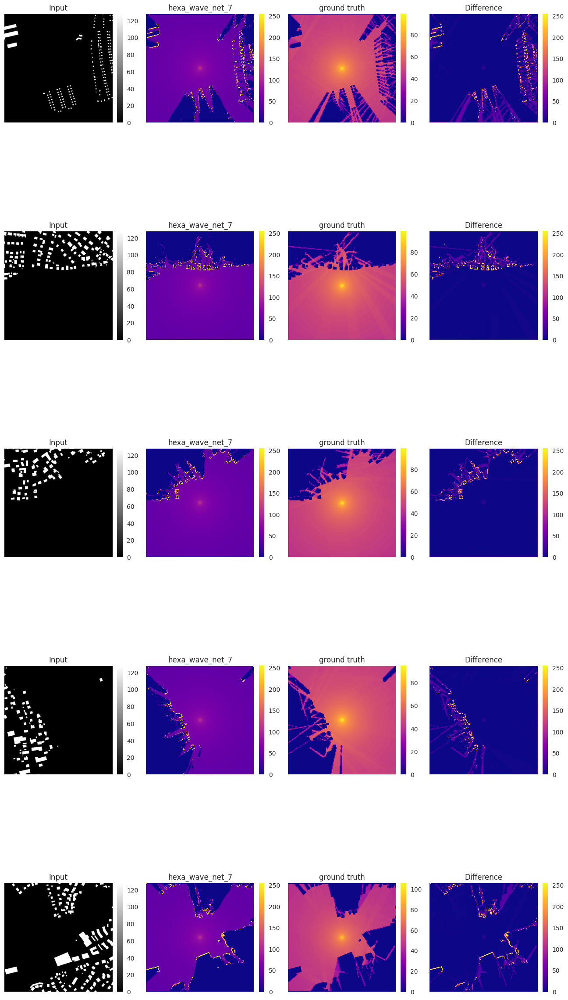
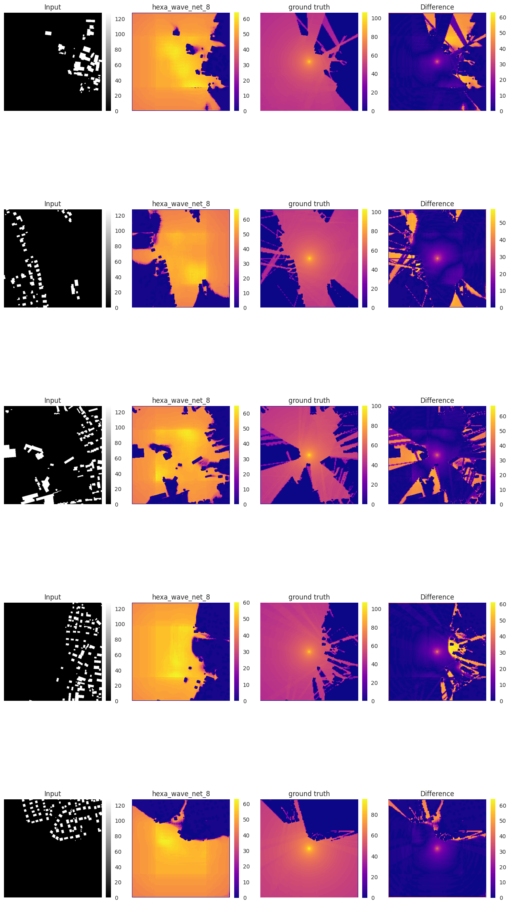

<!--
### Notice

This fork changes a Pix2Pix Fork for applying NoiseModelling Dataset (also Base Simulation as input) and the PhysGen Dataset with the Pix2Pix Model. It also adds some helpful [run commands](#start-a-training-in-remote-ssh).<br>
This fork adds following architectures: Stacked U-Net, TransU-Net & TransConvUNext.<br>
This fork also adds some additional architecture try outs. All are collected under the name "Hexa Wave Net" but some are just transformer or other architectures. See the [Hexa Wave Net python file](./models/hexa_wave_net_model.py) for the different architectures. The new argument *--model_type* defines the used architecture.

All Architectures got tested and some did make good results but it would need more engineering (learning rate, loss, ...) and testing to really tell about the results.

I still think it is a interesting architecture and it is exciting to try out new/other architectures. So the architecture itself may fail for this task but see the architecture(s) as reference and maybe there is only a little issue and the architecture does work.

Moreover this fork implements a Complex Focus Only (Residual Learning) Architecture with Pix2Pix, Masked (Sample) Training with Pix2Pix (Post and pre) and adding simple Ray-Tracing simulation results to the input.

<br><br>
-->

### Contents:
- [Extended Pix2Pix](#extended-pix2pix)
  - [Architecture](#architecture)
  - [Notice to naming/classification](#notice-to-namingclassification)
  - [Installing a working python/conda env](#installing-a-working-pythonconda-env)
  - [Start a Training](#start-a-training-in-remote-ssh)
  - [Transfer your data to training node/server](#transfer-your-data-to-training-nodeserver)
  - [Testing](#testing)
- [Pix2Pix (original)](#pix2pix)

<br><br>

---

<br>

# Extended Pix2Pix

This is the Repo for Pix2Pix applied to the PhysGen Benchmark!

Contribution:
- Pre & Post Masked Sample Training
- Residual Design (CFO = Complex Focus Only -> splits the task in 2 seperate ones and applies 2 pix2pix on each)
- Weighted Combined Loss (SSIM, L1, Edge Loss, ...)
- Architecture Try-Outs like Hexa-Wave-Net

</img>


<br><br>


### Architecture

Pix2Pix:
```
                 ┌───────────────────────────────────────────────┐
                 │                 GENERATOR (U-Net)             │
                 └───────────────────────────────────────────────┘

 Input Image
     │
     v
 ┌───────────┐
 │  Encoder  │  Downsampling path (features grow, size shrinks)
 └───────────┘
     │
     v
  [D1] 256→128  ────────────────┐
  [D2] 128→64   ────────────────┤ skip connections
  [D3] 64→32    ────────────────┤ (copied to decoder)
  [D4] 32→16    ────────────────┤
  [D5] 16→8     ────────────────┤
  [D6] 8→4      ────────────────┤
  [D7] 4→2      ────────────────┤
  [Bottleneck] 2→1              │
                                │
                                v
 ┌───────────┐
 │ Decoder   │  Upsampling path (features shrink, size grows)
 └───────────┘

  [U1] 1→2      + skip(D7)
  [U2] 2→4      + skip(D6)
  [U3] 4→8      + skip(D5)
  [U4] 8→16     + skip(D4)
  [U5] 16→32    + skip(D3)
  [U6] 32→64    + skip(D2)
  [U7] 64→128   + skip(D1)
     │
     v
 Output Image (same size as input)


             ┌───────────────────────────────────────────────┐
             │            DISCRIMINATOR (PatchGAN)           │
             └───────────────────────────────────────────────┘

 Concatenate:  (Input Image || Target or Generated Image)
     │
     v
  [C1] Convolution
     ↓
  [C2] Convolution
     ↓
  [C3] Convolution
     ↓
  [C4] Convolution
     ↓
  [Output Patch Map]  →  e.g., 30×30 grid of real/fake values

```
Amount of parameters Pix2Pix:
```txt
[Generator] Total number of parameters : 54.408 M
[Discriminator] Total number of parameters : 2.765 M
```

<br><br>

Complex Focus Only (Residual Learning) Idea:
```
                 +---------------------+
                 |        OSM          |  ← Input (OpenStreetMap)
                 +---------------------+
                           |
          +----------------+----------------+
          |                                 |
+-------------------+           +------------------------+
|    Base Model     |           |     Complex Model      |
|     (Pix2Pix)     |           |       (Pix2Pix)        |
| GAN + L1 Loss     |           | GAN + Weighted Loss    |
| Output: Baseline  |           | Output: Complex Only   |
|  Propagation Map  |           |  (Reflection/Diff.)    |
+-------------------+           +------------------------+
          |                                 |
          +----------------+----------------+
                           |
                 +---------------------+
                 |     Fusion Head     |
                 |   (Conv2D network)  |
                 | Input: Base +       |
                 | Complex On. Outputs |
                 | Output: Final Map   |
                 +---------------------+        
```

Amount of parameters Pix2Pix CFO / Residual Design:
```txt
[Base Generator] Total number of parameters : 54.408 M
[Base Discriminator] Total number of parameters : 2.765 M
[Complex Generator] Total number of parameters : 54.408 M
[Complex Discriminator] Total number of parameters : 2.765 M
[Fusion Head] ?
```

<br><br>

Base Hexa-Wave Net Idea:
```
        Input: 256x256xC
           ↓
  CNN Encoder (ConvNeXt): extracts local features
           ↓
      FNO Layer(s): models long-range frequency-aware field behavior
           ↓
  Latent Transformer Block:
                    - Attention over spatial regions
                    - Acts as a saliency filter: learns where to focus
           ↓
     SIREN Decoder (predicts continuous field from coordinates + latent features)
           ↓
        Output: 256x256xC
```
Explanation of components in HexaWaveNet:

| Component   | Purpose                                         |
| ----------- | ----------------------------------------------- |
| CNN         | Captures **local features**                     |
| FNO         | Models **global frequency interactions**        |
| Transformer | **Learns saliency** dynamically in latent space |
| SIREN       | Refines sharp, **continuous signal** edges      |


<br><br>

### Notice to naming/classification

Pix2Pix is often described as a generative model, but strictly speaking, it performs conditional image-to-image translation using a U-Net with an additional adversarial loss.<br>
Unlike an unconditional GAN, Pix2Pix does not learn to generate samples from a data distribution (does not approximate the distribution of output images). Instead, it learns a deterministic mapping from an input image (e.g., OSM data) to a corresponding target image (e.g., sound propagation results).

The model does not contain an explicit source of randomness (respectively stochastic sampling) such as a latent vector $z$, except for dropout, the generator behaves deterministically.<br>
Thus, Pix2Pix is better understood as a predictive model that uses adversarial loss only to encourage sharper and more realistic outputs, rather than as a true generative model.


Given this, the project title `Can complex models learn complex relations?` could be better aligned with the method.
A more accurate title could be:
- `Improving Complex Feature Learning in Predictive Image-to-Image Models for Simulation Distillation`

<br>

Furthermore, investigating how much the adversarial loss actually improves performance in physical prediction tasks (such as sound propagation or other PhysGen-like domains) would be a valuable extension.


### Installing a working python/conda env:
```bash
cd ~
wget https://repo.anaconda.com/archive/Anaconda3-2024.10-1-Linux-x86_64.sh
bash Anaconda3-2024.10-1-Linux-x86_64.sh
export PATH="$HOME/anaconda3/bin:$PATH"
conda init

conda create -n gan python=3.8 pip -y
conda activate gan
pip install -r ./requirements.txt
pip install tqdm
```


### Start a Training (in remote SSH):

-> Train on setted GPU-devices by adding `--gpu_ids` (`--gpu_ids GPU_IDS     gpu ids: e.g. 0 0,1,2, 0,2. use -1 for CPU (default: 0)`)

-> See training parameters with `python train.py --help` (before activate caonda env: `conda activate gan`)

-> Notice that you should use `--use_val_dataset` (+ `--eval_epoch_freq 3 --mse_val_function`) in order to get really the best model and does not get influenced by overfitting (validation dataset is used for the best model).

-> Add your Weights & Bias API key:
```bash
conda activate gan
wandb login your_api_key_here
```
-> or remove *--use_wandb --wandb_project_name Master-PhysGen* from the arguments.

```bash
conda activate gan
cd ~/src/paired_image-to-image_translation
nohup python train.py --dataroot ~/does_not_matter --name pix2pix_1_0 --model pix2pix --n_epochs 100 --lr 0.003 --beta1 0.5 --batch_size 6 --lr_policy linear --dataset_mode physgen --variation sound_reflection --input_nc 1 --output_nc 1 --load_size 256 --use_wandb --wandb_project_name Master-PhysGen > ./pix2pix_1_0.log 2>&1 &
```

```bash
conda activate gan
cd ~/src/paired_image-to-image_translation
nohup python train.py --dataroot ~/does_not_matter --name pix2pix_1_0_wgangp --model pix2pix --n_epochs 100 --lr 0.003 --beta1 0.5 --batch_size 6 --lr_policy linear --dataset_mode physgen --variation sound_reflection --input_nc 1 --output_nc 1 --load_size 256 --wgangp --use_wandb --wandb_project_name Master-PhysGen > ./pix2pix_1_0_wgangp.log 2>&1 &
```

```bash
conda activate gan
cd ~/src/paired_image-to-image_translation
nohup python train.py --dataroot ~/does_not_matter --name hexa_wave_net_1_0 --model hexa_wave_net --n_epochs 64 --lr 0.003 --beta1 0.5 --batch_size 6 --lr_policy linear --dataset_mode physgen --variation sound_reflection --input_nc 1 --output_nc 1 --load_size 256 --lambda_L1 7.0 --lambda_GAN 2.0 --lambda_ssmi 2.0 --lambda_edge 5.0 --wgangp --use_wandb --wandb_project_name Master-PhysGen > ./training_hexa_wave_net_1_0.log 2>&1 &
```

HexaWavenet 1:
```bash
conda activate gan
cd ~/src/paired_image-to-image_translation
nohup python train.py --dataroot ~/does_not_matter --name hexa_wave_net_1 --model hexa_wave_net --n_epochs 64 --lr 0.0001 --beta1 0.5 --batch_size 6 --lr_policy linear --dataset_mode physgen --variation sound_reflection --input_nc 1 --output_nc 1 --load_size 256 --lambda_L1 100.0 --lambda_GAN 2.0 --lambda_ssmi 10.0 --lambda_edge 50.0 --use_wandb --wandb_project_name Master-PhysGen > ./hexa_wave_net_1.log 2>&1 &
```

HexaWavenet 2 -> No Latent Transformer, CNN Decoder + SIREN Decoder + Image:
```bash
conda activate gan
cd ~/src/paired_image-to-image_translation
nohup python train.py --dataroot ~/does_not_matter --name hexa_wave_net_2 --model hexa_wave_net --n_epochs 64 --lr 0.0001 --beta1 0.5 --batch_size 6 --lr_policy linear --dataset_mode physgen --variation sound_reflection --input_nc 1 --output_nc 1 --load_size 256 --lambda_L1 100.0 --lambda_GAN 2.0 --lambda_ssmi 10.0 --lambda_edge 50.0 --model_type 2 --use_wandb --wandb_project_name Master-PhysGen > ./hexa_wave_net_2.log 2>&1 &
```

HexaWavenet 3 -> MLP Head:
```bash
conda activate gan
cd ~/src/paired_image-to-image_translation
nohup python train.py --dataroot ~/does_not_matter --name hexa_wave_net_3 --model hexa_wave_net --n_epochs 64 --lr 0.0007 --beta1 0.5 --batch_size 6 --lr_policy linear --dataset_mode physgen --variation sound_reflection --input_nc 1 --output_nc 1 --load_size 256 --lambda_L1 100.0 --lambda_GAN 2.0 --lambda_ssmi 10.0 --lambda_edge 50.0 --model_type 3 --use_wandb --wandb_project_name Master-PhysGen > ./hexa_wave_net_3.log 2>&1 &
```

SIREN End-to-End, Image-to-Image:
```bash
conda activate gan
cd ~/src/paired_image-to-image_translation
nohup python train.py --dataroot ~/does_not_matter --name hexa_wave_net_4 --model hexa_wave_net --n_epochs 64 --lr 0.0001 --beta1 0.5 --batch_size 6 --lr_policy linear --dataset_mode physgen --variation sound_reflection --input_nc 1 --output_nc 1 --load_size 256 --lambda_L1 100.0 --lambda_GAN 2.0 --lambda_ssmi 10.0 --lambda_edge 50.0 --model_type 4 --use_wandb --wandb_project_name Master-PhysGen > ./hexa_wave_net_4.log 2>&1 &
```

FNO End-to-End, Image-to-Image:
```bash
conda activate gan
cd ~/src/paired_image-to-image_translation
nohup python train.py --dataroot ~/does_not_matter --name hexa_wave_net_5 --model hexa_wave_net --n_epochs 64 --lr 0.0001 --beta1 0.5 --batch_size 6 --lr_policy linear --dataset_mode physgen --variation sound_reflection --input_nc 1 --output_nc 1 --load_size 256 --lambda_L1 7.0 --lambda_GAN 2.0 --lambda_ssmi 2.0 --lambda_edge 5.0 --model_type 5 --use_wandb --wandb_project_name Master-PhysGen > ./hexa_wave_net_5.log 2>&1 &
```

HexaWaveNet with a normal CNN Encoder (not ConvNext):
```bash
conda activate gan
cd ~/src/paired_image-to-image_translation
nohup python train.py --dataroot ~/does_not_matter --name hexa_wave_net_1_0_6 --model hexa_wave_net --n_epochs 64 --lr 0.0001 --beta1 0.5 --batch_size 6 --lr_policy linear --dataset_mode physgen --variation sound_reflection --input_nc 1 --output_nc 1 --load_size 256 --lambda_L1 7.0 --lambda_GAN 2.0 --lambda_ssmi 2.0 --lambda_edge 5.0 --model_type 6 --use_wandb --wandb_project_name Master-PhysGen > ./training_hexa_wave_net_1_0_6.log 2>&1 &
```

HexaWaveNet with a normal CNN Encoder + MLP Head + no SIREN Decoder + Transformer Latent Space decoder:
```bash
conda activate gan
cd ~/src/paired_image-to-image_translation
nohup python train.py --dataroot ~/does_not_matter --name hexa_wave_net_7 --model hexa_wave_net --n_epochs 64 --lr 0.0001 --beta1 0.5 --batch_size 6 --lr_policy linear --dataset_mode physgen --variation sound_reflection --input_nc 1 --output_nc 1 --load_size 256 --lambda_L1 100.0 --lambda_GAN 2.0 --lambda_ssmi 10.0 --lambda_edge 50.0 --model_type 7 --use_wandb --wandb_project_name Master-PhysGen > ./hexa_wave_net_7.log 2>&1 &
```

HexaWaveNet with a normal CNN Encoder + MLP Head + no SIREN Decoder + Transformer Latent Space decoder:
```bash
conda activate gan
cd ~/src/paired_image-to-image_translation
nohup python train.py --dataroot ~/does_not_matter --name hexa_wave_net_8 --model hexa_wave_net --n_epochs 64 --lr 0.0001 --beta1 0.5 --batch_size 6 --lr_policy linear --dataset_mode physgen --variation sound_reflection --input_nc 1 --output_nc 1 --load_size 256 --lambda_L1 100.0 --lambda_GAN 2.0 --lambda_ssmi 10.0 --lambda_edge 50.0 --model_type 8 --use_wandb --wandb_project_name Master-PhysGen > ./hexa_wave_net_8.log 2>&1 & 
```

Transformer encoder-decoder Architecture:
```bash
conda activate gan
cd ~/src/paired_image-to-image_translation
nohup python train.py --dataroot ~/does_not_matter --name transformer_only --model hexa_wave_net --n_epochs 64 --lr 0.0001 --beta1 0.5 --batch_size 6 --lr_policy linear --dataset_mode physgen --variation sound_reflection --input_nc 1 --output_nc 1 --load_size 256 --lambda_L1 7.0 --lambda_GAN 2.0 --lambda_ssmi 2.0 --lambda_edge 5.0 --model_type 9 --use_wandb --wandb_project_name Master-PhysGen > ./transformer_only.log 2>&1 &
```

HexaWavenet 3 -> MLP Head but with different loss:
```bash
conda activate gan
cd ~/src/paired_image-to-image_translation
nohup python train.py --dataroot ~/does_not_matter --name hexa_wave_net_1_0_3_other_loss --model hexa_wave_net --n_epochs 64 --lr 0.0007 --beta1 0.5 --batch_size 6 --lr_policy linear --dataset_mode physgen --variation sound_reflection --input_nc 1 --output_nc 1 --load_size 256 --lambda_L1 100.0 --lambda_GAN 1.0 --lambda_ssmi 10.0 --lambda_edge 30.0 --model_type 3 --use_wandb --wandb_project_name Master-PhysGen > ./training_hexa_wave_net_1_0_3_other_loss.log 2>&1 &
```


Physgen Prediction with TransU-Net & TransConvUNext:
```bash
cd ~/src/paired_image-to-image_translation
conda activate gan

nohup python train.py --dataroot ~/data/does_not_matter  --name transunet_1_0 --model transunet --n_epochs 100 --lr 0.0002 --beta1 0.5 --batch_size 12 --lr_policy linear --dataset_mode physgen --variation sound_reflection --input_nc 1 --output_nc 1 --gan_mode lsgan --load_size 256 --netG unet_256 --max_dataset_size inf --use_wandb --wandb_project_name Master-PhysGen > ./transunet_1_0.log 2>&1 &

nohup python train.py --dataroot ~/data/does_not_matter  --name transconvunext_1_0 --model transconvunext --n_epochs 100 --lr 0.0002 --beta1 0.5 --batch_size 12 --lr_policy linear --dataset_mode physgen --variation sound_reflection --input_nc 1 --output_nc 1 --gan_mode lsgan --load_size 256 --netG unet_256 --max_dataset_size inf --use_wandb --wandb_project_name Master-PhysGen > ./transconvunext_1_0.log 2>&1 &
```

**Pix2Pix Complex Focus Only:**
```bash
conda activate gan
cd ~/src/paired_image-to-image_translation
nohup python train.py --dataroot ~/does_not_matter --name pix2pix_cfo_2 --model pix2pix_cfo --n_epochs 100 --lr 0.0001 --beta1 0.5 --batch_size 1 --lr_policy linear --dataset_mode physgen --variation sound_reflection --input_nc 1 --output_nc 1 --load_size 256 --lambda_second 100.0 --use_wandb --wandb_project_name Master-PhysGen > ./pix2pix_cfo_2.log 2>&1 &

nohup python train.py --dataroot ~/does_not_matter --name pix2pix_cfo_2_wgangp --model pix2pix_cfo --n_epochs 20 --lr 0.0001 --beta1 0.5 --batch_size 1 --lr_policy linear --dataset_mode physgen --variation sound_reflection --input_nc 1 --output_nc 1 --load_size 256 --lambda_second 100.0 --wgangp  --use_wandb --wandb_project_name Master-PhysGen > ./pix2pix_cfo_2_wgangp.log 2>&1 &
```

With 2 seperate losses for base and complex + batchsize fixed:

```bash
if is_base_model:
    self.combined_loss = WeightedCombinedLoss(silog_lambda=0.0, 
                                                weight_silog=0.0, 
                                                weight_grad=0.0, 
                                                weight_ssim=0.0,
                                                weight_edge_aware=0.0,
                                                weight_l1=1.0,
                                                weight_var=0.0,
                                                weight_range=0.0)
else:
    self.combined_loss = WeightedCombinedLoss(silog_lambda=0.0, 
                                                weight_silog=0.5, 
                                                weight_grad=50.0, 
                                                weight_ssim=100.0,
                                                weight_edge_aware=50.0,
                                                weight_l1=10.0,
                                                weight_var=0.0,
                                                weight_range=0.0)

conda activate gan
cd ~/src/paired_image-to-image_translation
nohup python train.py --dataroot ~/does_not_matter --name pix2pix_cfo_adjusted_losses --model pix2pix_cfo --n_epochs 100 --lr 0.00005 --beta1 0.5 --batch_size 128 --lr_policy linear --dataset_mode physgen --variation sound_reflection --input_nc 1 --output_nc 1 --load_size 256 --lambda_second 100.0 --use_cfg_loss > ./logs/pix2pix_cfo_adjusted_losses.log 2>&1 &
```

```bash
if is_base_model:
    self.combined_loss = WeightedCombinedLoss(silog_lambda=0.0, 
                                                weight_silog=0.0, 
                                                weight_grad=0.0, 
                                                weight_ssim=0.0,
                                                weight_edge_aware=0.0,
                                                weight_l1=1.0,
                                                weight_var=0.0,
                                                weight_range=0.0)
else:
    self.combined_loss = WeightedCombinedLoss(silog_lambda=0.0, 
                                                weight_silog=0.0, 
                                                weight_grad=5.0, 
                                                weight_ssim=10.0,
                                                weight_edge_aware=5.0,
                                                weight_l1=0.5,
                                                weight_var=0.0,
                                                weight_range=0.0)

conda activate gan
cd ~/src/paired_image-to-image_translation
nohup python train.py --dataroot ~/does_not_matter --name pix2pix_cfo_adjusted_losses_2 --model pix2pix_cfo --n_epochs 100 --lr 0.00005 --beta1 0.5 --batch_size 128 --lr_policy linear --dataset_mode physgen --variation sound_reflection --input_nc 1 --output_nc 1 --load_size 256 --lambda_second 100.0 --use_cfg_loss > ./logs/pix2pix_cfo_adjusted_losses_2.log 2>&1 &
```

Using a inverted weight-map to counter the unbalanced histogram:

> Notice that this weighted map (`--calc_weight_map_for_cfg_loss`) is currently only available for Pix2Pix-CFO (complex focus only / residual design) not for the standard Pix2Pix or other models. + the calculation of the weighted maps will take much time and therfore the training time is increased by a huge amount (fix is in work)

(applied on base and complex)
```bash
if is_base_model:
    self.combined_loss = WeightedCombinedLoss(silog_lambda=0.0, 
                                                weight_silog=0.0, 
                                                weight_grad=0.0, 
                                                weight_ssim=0.0,
                                                weight_edge_aware=0.0,
                                                weight_l1=1.0,
                                                weight_var=0.0,
                                                weight_range=0.0)
else:
    self.combined_loss = WeightedCombinedLoss(silog_lambda=0.0, 
                                                weight_silog=0.0, 
                                                weight_grad=5.0, 
                                                weight_ssim=10.0,
                                                weight_edge_aware=5.0,
                                                weight_l1=0.5,
                                                weight_var=0.0,
                                                weight_range=0.0)

conda activate gan
cd ~/src/paired_image-to-image_translation
nohup python train.py --dataroot ~/does_not_matter --name pix2pix_cfo_weighted_adjusted_losses_1 --model pix2pix_cfo --n_epochs 100 --lr 0.00005 --beta1 0.5 --batch_size 128 --lr_policy linear --dataset_mode physgen --variation sound_reflection --input_nc 1 --output_nc 1 --load_size 256 --lambda_second 100.0 --use_cfg_loss --calc_weight_map_for_cfg_loss > ./logs/pix2pix_cfo_weighted_adjusted_losses_1.log 2>&1 &
```

(applied on base and complex)
```bash
if is_base_model:
    self.combined_loss = WeightedCombinedLoss(silog_lambda=0.0, 
                                                weight_silog=0.0, 
                                                weight_grad=0.0, 
                                                weight_ssim=0.0,
                                                weight_edge_aware=0.0,
                                                weight_l1=1.0,
                                                weight_var=0.0,
                                                weight_range=0.0)
else:
    self.combined_loss = WeightedCombinedLoss(silog_lambda=0.0, 
                                                weight_silog=0.0, 
                                                weight_grad=5.0, 
                                                weight_ssim=10.0,
                                                weight_edge_aware=5.0,
                                                weight_l1=10.0,
                                                weight_var=0.0,
                                                weight_range=0.0)

conda activate gan
cd ~/src/paired_image-to-image_translation
nohup python train.py --dataroot ~/does_not_matter --name pix2pix_cfo_weighted_adjusted_losses_2 --model pix2pix_cfo --n_epochs 100 --lr 0.00005 --beta1 0.5 --batch_size 128 --lr_policy linear --dataset_mode physgen --variation sound_reflection --input_nc 1 --output_nc 1 --load_size 256 --lambda_second 100.0 --use_cfg_loss --calc_weight_map_for_cfg_loss --gpu_ids 1 > ./logs/pix2pix_cfo_weighted_adjusted_losses_2.log 2>&1 &
```

Now with only applied on complex part:
```bash
if is_base_model:
    self.combined_loss = WeightedCombinedLoss(silog_lambda=0.0, 
                                                weight_silog=0.0, 
                                                weight_grad=0.0, 
                                                weight_ssim=0.0,
                                                weight_edge_aware=0.0,
                                                weight_l1=1.0,
                                                weight_var=0.0,
                                                weight_range=0.0)
else:
    self.combined_loss = WeightedCombinedLoss(silog_lambda=0.0, 
                                                weight_silog=0.0, 
                                                weight_grad=5.0, 
                                                weight_ssim=10.0,
                                                weight_edge_aware=5.0,
                                                weight_l1=0.5,
                                                weight_var=0.0,
                                                weight_range=0.0)

conda activate gan
cd ~/src/paired_image-to-image_translation
nohup python train.py --dataroot ~/does_not_matter --name pix2pix_cfo_weighted_adjusted_losses_1_only_complex_loss_weighting --model pix2pix_cfo --n_epochs 100 --lr 0.00005 --beta1 0.5 --batch_size 128 --lr_policy linear --dataset_mode physgen --variation sound_reflection --input_nc 1 --output_nc 1 --load_size 128 --lambda_second 100.0 --use_cfg_loss --calc_weight_map_for_cfg_loss --gpu_ids 1 > ./logs/pix2pix_cfo_weighted_adjusted_losses_1_only_complex_loss_weighting.log 2>&1 &
```
```bash
if is_base_model:
    self.combined_loss = WeightedCombinedLoss(silog_lambda=0.0, 
                                                weight_silog=0.0, 
                                                weight_grad=0.0, 
                                                weight_ssim=0.0,
                                                weight_edge_aware=0.0,
                                                weight_l1=1.0,
                                                weight_var=0.0,
                                                weight_range=0.0)
else:
    self.combined_loss = WeightedCombinedLoss(silog_lambda=0.0, 
                                                weight_silog=0.0, 
                                                weight_grad=5.0, 
                                                weight_ssim=10.0,
                                                weight_edge_aware=5.0,
                                                weight_l1=10.0,
                                                weight_var=0.0,
                                                weight_range=0.0)

conda activate gan
cd ~/src/paired_image-to-image_translation
nohup python train.py --dataroot ~/does_not_matter --name pix2pix_cfo_weighted_adjusted_losses_2_only_complex_loss_weighting --model pix2pix_cfo --n_epochs 100 --lr 0.00005 --beta1 0.5 --batch_size 128 --lr_policy linear --dataset_mode physgen --variation sound_reflection --input_nc 1 --output_nc 1 --load_size 128 --lambda_second 100.0 --use_cfg_loss --calc_weight_map_for_cfg_loss --gpu_ids 2 > ./logs/pix2pix_cfo_weighted_adjusted_losses_2_only_complex_loss_weighting.log 2>&1 &
```

After fixing performance of CFO map calculation (same model as before):
```bash
if is_base_model:
    self.combined_loss = WeightedCombinedLoss(silog_lambda=0.0, 
                                                weight_silog=0.0, 
                                                weight_grad=0.0, 
                                                weight_ssim=0.0,
                                                weight_edge_aware=0.0,
                                                weight_l1=1.0,
                                                weight_var=0.0,
                                                weight_range=0.0)
else:
    self.combined_loss = WeightedCombinedLoss(silog_lambda=0.0, 
                                                weight_silog=0.0, 
                                                weight_grad=5.0, 
                                                weight_ssim=10.0,
                                                weight_edge_aware=5.0,
                                                weight_l1=10.0,
                                                weight_var=0.0,
                                                weight_range=0.0)

conda activate gan
cd ~/src/paired_image-to-image_translation
nohup python train.py --dataroot ~/does_not_matter --name pix2pix_cfo_weighted_adjusted_losses_2_only_complex_loss_weighting_loaded_weights --model pix2pix_cfo --n_epochs 80 --lr 0.00005 --beta1 0.5 --batch_size 128 --lr_policy linear --dataset_mode physgen --variation sound_reflection --input_nc 1 --output_nc 1 --load_size 64 --lambda_second 100.0 --use_cfg_loss --calc_weight_map_for_cfg_loss --gpu_ids 2 > ./logs/pix2pix_cfo_weighted_adjusted_losses_2_only_complex_loss_weighting_loaded_weights.log 2>&1 &
```

**Removed CPU bottleneck + changed loss weighting:**

<!--
```bash
if is_base_model:
    self.combined_loss = WeightedCombinedLoss(silog_lambda=0.0, 
                                                weight_silog=0.0, 
                                                weight_grad=0.0, 
                                                weight_ssim=0.0,
                                                weight_edge_aware=0.0,
                                                weight_l1=1.0,
                                                weight_var=0.0,
                                                weight_range=0.0,
                                                weight_blur=0.0)
else:
    self.combined_loss = WeightedCombinedLoss(silog_lambda=0.0, 
                                              weight_silog=0.0, 
                                              weight_grad=0.0, 
                                              weight_ssim=100.0,
                                              weight_edge_aware=0.0,
                                              weight_l1=100.0,
                                              weight_var=1.0,
                                              weight_range=1.0,
                                              weight_blur=10.0)

conda activate gan
cd ~/src/paired_image-to-image_translation
nohup python train.py --dataroot ~/does_not_matter --name pix2pix_cfo_weighted_adjusted_losses_3_only_complex_loss_weighting_loaded_weights_optimized --model pix2pix_cfo --n_epochs 80 --lr 0.00005 --beta1 0.5 --batch_size 128 --lr_policy linear --dataset_mode physgen --variation sound_reflection --input_nc 1 --output_nc 1 --load_size 64 --lambda_second 100.0 --use_cfg_loss --calc_weight_map_for_cfg_loss --reducing_cpu_bottleneck_over_gpu_memory --gpu_ids 0 > ./logs/pix2pix_cfo_weighted_adjusted_losses_3_only_complex_loss_weighting_loaded_weights_optimized.log 2>&1 &
```
> Did not learned the complex part
-->

```bash
if is_base_model:
    self.combined_loss = WeightedCombinedLoss(silog_lambda=0.0, 
                                                weight_silog=0.0, 
                                                weight_grad=0.0, 
                                                weight_ssim=0.0,
                                                weight_edge_aware=0.0,
                                                weight_l1=1.0,
                                                weight_var=0.0,
                                                weight_range=0.0,
                                                weight_blur=0.0)
else:
    self.combined_loss = WeightedCombinedLoss(silog_lambda=0.0, 
                                              weight_silog=0.0, 
                                              weight_grad=0.0, 
                                              weight_ssim=100.0,
                                              weight_edge_aware=0.0,
                                              weight_l1=100.0,
                                              weight_var=1.0,
                                              weight_range=1.0,
                                              weight_blur=10.0)

conda activate gan
cd ~/src/paired_image-to-image_translation
nohup python train.py --dataroot ~/does_not_matter --name pix2pix_cfo_weighted_adjusted_losses_3_loaded_weights_optimized --model pix2pix_cfo --n_epochs 80 --lr 0.0001 --beta1 0.5 --batch_size 128 --lr_policy linear --dataset_mode physgen --variation sound_reflection --input_nc 1 --output_nc 1 --load_size 64 --lambda_second 100.0 --reducing_cpu_bottleneck_over_gpu_memory --gpu_ids 0 --use_val_dataset --eval_epoch_freq 3 --mse_val_function --save_only_best_model > ./logs/pix2pix_cfo_weighted_adjusted_losses_3_loaded_weights_optimized.log 2>&1 &
```

<!--
```bash
if is_base_model:
    self.combined_loss = WeightedCombinedLoss(silog_lambda=0.0, 
                                                weight_silog=0.0, 
                                                weight_grad=0.0, 
                                                weight_ssim=0.0,
                                                weight_edge_aware=0.0,
                                                weight_l1=1.0,
                                                weight_var=0.0,
                                                weight_range=0.0,
                                                weight_blur=0.0)
else:
    self.combined_loss = WeightedCombinedLoss(silog_lambda=0.0, 
                                              weight_silog=0.0, 
                                              weight_grad=0.0, 
                                              weight_ssim=10.0,
                                              weight_edge_aware=0.0,
                                              weight_l1=1.0,
                                              weight_var=1.0,
                                              weight_range=1.0,
                                              weight_blur=0.0)

conda activate gan
cd ~/src/paired_image-to-image_translation
nohup python train.py --dataroot ~/does_not_matter --name pix2pix_cfo_weighted_adjusted_losses_4_only_complex_loss_weighting_loaded_weights_optimized --model pix2pix_cfo --n_epochs 80 --lr 0.00005 --beta1 0.5 --batch_size 128 --lr_policy linear --dataset_mode physgen --variation sound_reflection --input_nc 1 --output_nc 1 --load_size 64 --lambda_second 100.0 --use_cfg_loss --calc_weight_map_for_cfg_loss --reducing_cpu_bottleneck_over_gpu_memory --gpu_ids 0 --use_val_dataset --eval_epoch_freq 3 > ./logs/pix2pix_cfo_weighted_adjusted_losses_4_only_complex_loss_weighting_loaded_weights_optimized.log 2>&1 &
```
-->

```bash
if is_base_model:
    self.combined_loss = WeightedCombinedLoss(silog_lambda=0.0, 
                                                weight_silog=0.0, 
                                                weight_grad=0.0, 
                                                weight_ssim=0.0,
                                                weight_edge_aware=0.0,
                                                weight_l1=1.0,
                                                weight_var=0.0,
                                                weight_range=0.0,
                                                weight_blur=0.0)
else:
    self.combined_loss = WeightedCombinedLoss(silog_lambda=0.0, 
                                              weight_silog=0.0, 
                                              weight_grad=0.0, 
                                              weight_ssim=10.0,
                                              weight_edge_aware=0.0,
                                              weight_l1=1.0,
                                              weight_var=1.0,
                                              weight_range=1.0,
                                              weight_blur=0.0)

conda activate gan
cd ~/src/paired_image-to-image_translation
nohup python train.py --dataroot ~/does_not_matter --name pix2pix_cfo_weighted_adjusted_losses_4_loaded_weights_optimized --model pix2pix_cfo --n_epochs 80 --lr 0.0001 --beta1 0.5 --batch_size 128 --lr_policy linear --dataset_mode physgen --variation sound_reflection --input_nc 1 --output_nc 1 --load_size 64 --lambda_second 100.0 --reducing_cpu_bottleneck_over_gpu_memory --gpu_ids 0 --use_val_dataset --eval_epoch_freq 3 --mse_val_function --save_only_best_model > ./logs/pix2pix_cfo_weighted_adjusted_losses_4_loaded_weights_optimized.log 2>&1 &
```


**Residual Design (CFO) with simulated reflections:**<br>
```bash
if is_base_model:
    self.combined_loss = WeightedCombinedLoss(silog_lambda=0.0, 
                                                weight_silog=0.0, 
                                                weight_grad=0.0, 
                                                weight_ssim=0.0,
                                                weight_edge_aware=0.0,
                                                weight_l1=1.0,
                                                weight_var=0.0,
                                                weight_range=0.0,
                                                weight_blur=0.0)
else:
    self.combined_loss = WeightedCombinedLoss(silog_lambda=0.0, 
                                              weight_silog=0.0, 
                                              weight_grad=0.0, 
                                              weight_ssim=100.0,
                                              weight_edge_aware=0.0,
                                              weight_l1=100.0,
                                              weight_var=1.0,
                                              weight_range=1.0,
                                              weight_blur=10.0)

conda activate gan
cd ~/src/paired_image-to-image_translation
nohup python train.py --dataroot ~/does_not_matter --name pix2pix_cfo_ips_36_one_channel_weighted_adjusted_losses_3_loaded_weights_optimized --model pix2pix_cfo --n_epochs 80 --lr 0.0001 --beta1 0.5 --batch_size 128 --lr_policy linear --dataset_mode physgen --variation sound_reflection --input_nc 2 --output_nc 1 --load_size 64 --lambda_second 100.0 --reducing_cpu_bottleneck_over_gpu_memory --gpu_ids 0 --use_val_dataset --eval_epoch_freq 3 --mse_val_function --save_only_best_model --reflexion_channels --reflexion_steps 36 > ./logs/pix2pix_cfo_ips_36_one_channel_weighted_adjusted_losses_3_loaded_weights_optimized.log 2>&1 &
```

```bash
if is_base_model:
    self.combined_loss = WeightedCombinedLoss(silog_lambda=0.0, 
                                                weight_silog=0.0, 
                                                weight_grad=0.0, 
                                                weight_ssim=0.0,
                                                weight_edge_aware=0.0,
                                                weight_l1=1.0,
                                                weight_var=0.0,
                                                weight_range=0.0,
                                                weight_blur=0.0)
else:
    self.combined_loss = WeightedCombinedLoss(silog_lambda=0.0, 
                                              weight_silog=0.0, 
                                              weight_grad=0.0, 
                                              weight_ssim=10.0,
                                              weight_edge_aware=0.0,
                                              weight_l1=1.0,
                                              weight_var=1.0,
                                              weight_range=1.0,
                                              weight_blur=0.0)

conda activate gan
cd ~/src/paired_image-to-image_translation
nohup python train.py --dataroot ~/does_not_matter --name pix2pix_cfo_ips_36_one_channel_weighted_adjusted_losses_4_loaded_weights_optimized --model pix2pix_cfo --n_epochs 80 --lr 0.0001 --beta1 0.5 --batch_size 128 --lr_policy linear --dataset_mode physgen --variation sound_reflection --input_nc 2 --output_nc 1 --load_size 64 --lambda_second 100.0 --reducing_cpu_bottleneck_over_gpu_memory --gpu_ids 0 --use_val_dataset --eval_epoch_freq 3 --mse_val_function --save_only_best_model --reflexion_channels --reflexion_steps 36 > ./logs/pix2pix_cfo_ips_36_one_channel_weighted_adjusted_losses_4_loaded_weights_optimized.log 2>&1 &
```

New try:

```bash
self.optimizer_G = torch.optim.Adam(self.netG.parameters(), lr=opt.lr*5e+10, betas=(opt.beta1, 0.999))

if is_base_model:
    self.combined_loss = WeightedCombinedLoss(silog_lambda=0.0, 
                                                weight_silog=0.0, 
                                                weight_grad=0.0, 
                                                weight_ssim=0.0,
                                                weight_edge_aware=0.0,
                                                weight_l1=1.0,
                                                weight_var=0.0,
                                                weight_range=0.0,
                                                weight_blur=0.0)
else:
    self.combined_loss = WeightedCombinedLoss(silog_lambda=0.0, 
                                                weight_silog=0.0, 
                                                weight_grad=0.0, 
                                                weight_ssim=1000.0,
                                                weight_edge_aware=0.0,
                                                weight_l1=1000.0,
                                                weight_var=10.0,
                                                weight_range=10.0,
                                                weight_blur=10.0)

nohup python train.py --dataroot ~/does_not_matter --name pix2pix_cfo_ips_36_one_channel_weighted_adjusted_losses_5_loaded_weights_optimized --model pix2pix_cfo --n_epochs 80 --lr 0.0001 --beta1 0.5 --batch_size 128 --lr_policy linear --dataset_mode physgen --variation sound_reflection --input_nc 2 --output_nc 1 --load_size 64 --lambda_second 100.0 --reducing_cpu_bottleneck_over_gpu_memory --gpu_ids 0 --use_val_dataset --eval_epoch_freq 3 --mse_val_function --save_only_best_model --reflexion_channels --reflexion_steps 36 > ./logs/pix2pix_cfo_ips_36_one_channel_weighted_adjusted_losses_5_loaded_weights_optimized.log 2>&1 &

nohup python train.py --dataroot ~/does_not_matter --name pix2pix_cfo_weighted_adjusted_losses_5_loaded_weights_optimized --model pix2pix_cfo --n_epochs 80 --lr 0.0001 --beta1 0.5 --batch_size 128 --lr_policy linear --dataset_mode physgen --variation sound_reflection --input_nc 1 --output_nc 1 --load_size 64 --lambda_second 100.0 --reducing_cpu_bottleneck_over_gpu_memory --gpu_ids 0 --use_val_dataset --eval_epoch_freq 3 --mse_val_function --save_only_best_model > ./logs/pix2pix_cfo_weighted_adjusted_losses_5_loaded_weights_optimized.log 2>&1 &
```
```bash
self.optimizer_G = torch.optim.Adam(self.netG.parameters(), lr=opt.lr*5e+100, betas=(opt.beta1, 0.999)) increase from 10 to 100

if is_base_model:
    self.combined_loss = WeightedCombinedLoss(silog_lambda=0.0, 
                                                weight_silog=0.0, 
                                                weight_grad=0.0, 
                                                weight_ssim=0.0,
                                                weight_edge_aware=0.0,
                                                weight_l1=1.0,
                                                weight_var=0.0,
                                                weight_range=0.0,
                                                weight_blur=0.0)
else:
    self.combined_loss = WeightedCombinedLoss(silog_lambda=0.0, 
                                                weight_silog=0.0, 
                                                weight_grad=0.0, 
                                                weight_ssim=1000.0,
                                                weight_edge_aware=0.0,
                                                weight_l1=1000.0,
                                                weight_var=0.0,
                                                weight_range=0.0,
                                                weight_blur=10.0)

nohup python train.py --dataroot ~/does_not_matter --name pix2pix_cfo_ips_36_one_channel_weighted_adjusted_losses_6_loaded_weights_optimized --model pix2pix_cfo --n_epochs 80 --lr 0.0001 --beta1 0.5 --batch_size 128 --lr_policy linear --dataset_mode physgen --variation sound_reflection --input_nc 2 --output_nc 1 --load_size 64 --lambda_second 100.0 --reducing_cpu_bottleneck_over_gpu_memory --gpu_ids 1 --use_val_dataset --eval_epoch_freq 3 --mse_val_function --save_only_best_model --reflexion_channels --reflexion_steps 36 > ./logs/pix2pix_cfo_ips_36_one_channel_weighted_adjusted_losses_6_loaded_weights_optimized.log 2>&1 &

nohup python train.py --dataroot ~/does_not_matter --name pix2pix_cfo_weighted_adjusted_losses_6_loaded_weights_optimized --model pix2pix_cfo --n_epochs 80 --lr 0.0001 --beta1 0.5 --batch_size 128 --lr_policy linear --dataset_mode physgen --variation sound_reflection --input_nc 1 --output_nc 1 --load_size 64 --lambda_second 100.0 --reducing_cpu_bottleneck_over_gpu_memory --gpu_ids 1 --use_val_dataset --eval_epoch_freq 3 --mse_val_function --save_only_best_model > ./logs/pix2pix_cfo_weighted_adjusted_losses_6_loaded_weights_optimized.log 2>&1 &
```

With complex model learning log scaled space:

```bash
self.optimizer_G = torch.optim.Adam(self.netG.parameters(), lr=opt.lr*5e+100, betas=(opt.beta1, 0.999)) increase from 10 to 100

if is_base_model:
    self.combined_loss = WeightedCombinedLoss(silog_lambda=0.0, 
                                                weight_silog=0.0, 
                                                weight_grad=0.0, 
                                                weight_ssim=0.0,
                                                weight_edge_aware=0.0,
                                                weight_l1=1.0,
                                                weight_var=0.0,
                                                weight_range=0.0,
                                                weight_blur=0.0)
else:
    self.combined_loss = WeightedCombinedLoss(silog_lambda=0.0, 
                                                weight_silog=0.0, 
                                                weight_grad=0.0, 
                                                weight_ssim=10.0,
                                                weight_edge_aware=0.0,
                                                weight_l1=100.0,
                                                weight_var=0.0,
                                                weight_range=0.0,
                                                weight_blur=0.0)

nohup python train.py --dataroot ~/does_not_matter --name pix2pix_cfo_weighted_adjusted_losses_7_log_space --model pix2pix_cfo --n_epochs 80 --lr 0.0001 --beta1 0.5 --batch_size 32 --lr_policy linear --dataset_mode physgen --variation sound_reflection --input_nc 1 --output_nc 1 --load_size 64 --lambda_second 100.0 --reducing_cpu_bottleneck_over_gpu_memory --use_cfg_loss --gpu_ids 0 --use_val_dataset --eval_epoch_freq 3 --mse_val_function --save_only_best_model --scale_complex_part > ./logs/pix2pix_cfo_weighted_adjusted_losses_7_log_space.log 2>&1 &
```


Other tries:

```bash
if is_base_model:
    self.combined_loss = WeightedCombinedLoss(silog_lambda=0.0, 
                                                weight_silog=0.0, 
                                                weight_grad=0.0, 
                                                weight_ssim=0.0,
                                                weight_edge_aware=0.0,
                                                weight_l1=1.0,
                                                weight_var=0.0,
                                                weight_range=0.0,
                                                weight_blur=0.0)
else:
    self.combined_loss = WeightedCombinedLoss(silog_lambda=0.0, 
                                                weight_silog=0.0, 
                                                weight_grad=0.0, 
                                                weight_ssim=10.0,
                                                weight_edge_aware=0.0,
                                                weight_l1=0.0,
                                                weight_var=1.0,
                                                weight_range=1.0,
                                                weight_blur=0.0)

nohup python train.py --dataroot ~/does_not_matter --name pix2pix_cfo_weighted_adjusted_losses_8 --model pix2pix_cfo --n_epochs 80 --lr 0.0001 --beta1 0.5 --batch_size 32 --lr_policy linear --dataset_mode physgen --variation sound_reflection --input_nc 1 --output_nc 1 --load_size 64 --lambda_second 100.0 --reducing_cpu_bottleneck_over_gpu_memory --use_cfg_loss --gpu_ids 0 --use_val_dataset --eval_epoch_freq 3 --mse_val_function --save_only_best_model > ./logs/pix2pix_cfo_weighted_adjusted_losses_8.log 2>&1 &
```

```bash
self.optimizer_G = torch.optim.Adam(self.netG.parameters(), lr=opt.lr*5e+100, betas=(opt.beta1, 0.999)) increase from 10 to 100

if is_base_model:
    self.combined_loss = WeightedCombinedLoss(silog_lambda=0.0, 
                                                weight_silog=0.0, 
                                                weight_grad=0.0, 
                                                weight_ssim=0.0,
                                                weight_edge_aware=0.0,
                                                weight_l1=1.0,
                                                weight_var=0.0,
                                                weight_range=0.0,
                                                weight_blur=0.0)
else:
    self.combined_loss = WeightedCombinedLoss(silog_lambda=0.0, 
                                                weight_silog=0.0, 
                                                weight_grad=0.0, 
                                                weight_ssim=0.0,
                                                weight_edge_aware=0.0,
                                                weight_l1=0.0,
                                                weight_var=10.0,
                                                weight_range=10.0,
                                                weight_blur=0.0)

nohup python train.py --dataroot ~/does_not_matter --name pix2pix_cfo_weighted_adjusted_losses_9 --model pix2pix_cfo --n_epochs 80 --lr 0.0001 --beta1 0.5 --batch_size 32 --lr_policy linear --dataset_mode physgen --variation sound_reflection --input_nc 1 --output_nc 1 --load_size 64 --lambda_second 100.0 --reducing_cpu_bottleneck_over_gpu_memory --gpu_ids 0 --use_val_dataset --eval_epoch_freq 3 --mse_val_function --save_only_best_model > ./logs/pix2pix_cfo_weighted_adjusted_losses_9.log 2>&1 &
```


```bash
self.optimizer_G = torch.optim.Adam(self.netG.parameters(), lr=opt.lr*5e-1, betas=(opt.beta1, 0.999)) increase from 10 to 100

if is_base_model:
    self.combined_loss = WeightedCombinedLoss(silog_lambda=0.0, 
                                                weight_silog=0.0, 
                                                weight_grad=0.0, 
                                                weight_ssim=0.0,
                                                weight_edge_aware=0.0,
                                                weight_l1=1.0,
                                                weight_var=0.0,
                                                weight_range=0.0,
                                                weight_blur=0.0)
else:
    self.combined_loss = WeightedCombinedLoss(silog_lambda=0.5, 
                                                weight_silog=10.0, 
                                                weight_grad=10.0, 
                                                weight_ssim=10.0,
                                                weight_edge_aware=10.0,
                                                weight_l1=10.0,
                                                weight_var=10.0,
                                                weight_range=10.0,
                                                weight_blur=10.0)

nohup python train.py --dataroot ~/does_not_matter --name pix2pix_cfo_weighted_adjusted_losses_10 --model pix2pix_cfo --n_epochs 80 --lr 0.0001 --beta1 0.5 --batch_size 32 --lr_policy linear --dataset_mode physgen --variation sound_reflection --input_nc 1 --output_nc 1 --load_size 64 --lambda_second 100.0 --reducing_cpu_bottleneck_over_gpu_memory --gpu_ids 0 --use_val_dataset --eval_epoch_freq 3 --mse_val_function --save_only_best_model > ./logs/pix2pix_cfo_weighted_adjusted_losses_10.log 2>&1 &
```

```bash
self.optimizer_G = torch.optim.Adam(self.netG.parameters(), lr=opt.lr*5e-1, betas=(opt.beta1, 0.999)) increase from 10 to 100

if is_base_model:
    self.combined_loss = WeightedCombinedLoss(silog_lambda=0.0, 
                                                weight_silog=0.0, 
                                                weight_grad=0.0, 
                                                weight_ssim=0.0,
                                                weight_edge_aware=0.0,
                                                weight_l1=1.0,
                                                weight_var=0.0,
                                                weight_range=0.0,
                                                weight_blur=0.0)
else:
    self.combined_loss = WeightedCombinedLoss(silog_lambda=0.5, 
                                                weight_silog=0.0, 
                                                weight_grad=0.0, 
                                                weight_ssim=10.0,
                                                weight_edge_aware=0.0,
                                                weight_l1=10.0,
                                                weight_var=1.0,
                                                weight_range=1.0,
                                                weight_blur=0.0)

nohup python train.py --dataroot ~/does_not_matter --name pix2pix_cfo_weighted_adjusted_losses_10 --model pix2pix_cfo --n_epochs 80 --lr 0.0001 --beta1 0.5 --batch_size 32 --lr_policy linear --dataset_mode physgen --variation sound_reflection --input_nc 1 --output_nc 1 --load_size 64 --lambda_second 100.0 --reducing_cpu_bottleneck_over_gpu_memory --gpu_ids 0 --use_val_dataset --eval_epoch_freq 3 --mse_val_function --save_only_best_model > ./logs/pix2pix_cfo_weighted_adjusted_losses_10.log 2>&1 &
```

```bash
self.optimizer_G = torch.optim.Adam(self.netG.parameters(), lr=opt.lr*5e-1, betas=(opt.beta1, 0.999)) increase from 10 to 100

if is_base_model:
    self.combined_loss = WeightedCombinedLoss(silog_lambda=0.0, 
                                                weight_silog=0.0, 
                                                weight_grad=0.0, 
                                                weight_ssim=0.0,
                                                weight_edge_aware=0.0,
                                                weight_l1=1.0,
                                                weight_var=0.0,
                                                weight_range=0.0,
                                                weight_blur=0.0)
else:
    self.combined_loss = WeightedCombinedLoss(silog_lambda=0.5, 
                                                weight_silog=1.0, 
                                                weight_grad=0.0, 
                                                weight_ssim=0.0,
                                                weight_edge_aware=0.0,
                                                weight_l1=100.0,
                                                weight_var=1.0,
                                                weight_range=1.0,
                                                weight_blur=0.0)

nohup python train.py --dataroot ~/does_not_matter --name pix2pix_cfo_weighted_adjusted_losses_11 --model pix2pix_cfo --n_epochs 80 --lr 0.0001 --beta1 0.5 --batch_size 32 --lr_policy linear --dataset_mode physgen --variation sound_reflection --input_nc 1 --output_nc 1 --load_size 64 --lambda_second 100.0 --reducing_cpu_bottleneck_over_gpu_memory --gpu_ids 0 --use_val_dataset --eval_epoch_freq 3 --mse_val_function --save_only_best_model > ./logs/pix2pix_cfo_weighted_adjusted_losses_11.log 2>&1 &
```

```bash
self.optimizer_G = torch.optim.Adam(self.netG.parameters(), lr=opt.lr*5e-1, betas=(opt.beta1, 0.999)) increase from 10 to 100

if is_base_model:
    self.combined_loss = WeightedCombinedLoss(silog_lambda=0.0, 
                                                weight_silog=0.0, 
                                                weight_grad=0.0, 
                                                weight_ssim=0.0,
                                                weight_edge_aware=0.0,
                                                weight_l1=1.0,
                                                weight_var=0.0,
                                                weight_range=0.0,
                                                weight_blur=0.0)
else:
    self.combined_loss = WeightedCombinedLoss(silog_lambda=0.5, 
                                                weight_silog=10.0, 
                                                weight_grad=10.0, 
                                                weight_ssim=10.0,
                                                weight_edge_aware=10.0,
                                                weight_l1=0.0,
                                                weight_var=0.0,
                                                weight_range=0.0,
                                                weight_blur=0.0)

nohup python train.py --dataroot ~/does_not_matter --name pix2pix_cfo_weighted_adjusted_losses_12 --model pix2pix_cfo --n_epochs 80 --lr 0.0001 --beta1 0.5 --batch_size 32 --lr_policy linear --dataset_mode physgen --variation sound_reflection --input_nc 1 --output_nc 1 --load_size 64 --lambda_second 100.0 --reducing_cpu_bottleneck_over_gpu_memory --use_cfg_loss --gpu_ids 0 --use_val_dataset --eval_epoch_freq 3 --mse_val_function --save_only_best_model > ./logs/pix2pix_cfo_weighted_adjusted_losses_12.log 2>&1 &
```


```bash
self.optimizer_G = torch.optim.Adam(self.netG.parameters(), lr=opt.lr*5e-1, betas=(opt.beta1, 0.999)) increase from 10 to 100

if is_base_model:
    self.combined_loss = WeightedCombinedLoss(silog_lambda=0.0, 
                                                weight_silog=0.0, 
                                                weight_grad=0.0, 
                                                weight_ssim=0.0,
                                                weight_edge_aware=0.0,
                                                weight_l1=1.0,
                                                weight_var=0.0,
                                                weight_range=0.0,
                                                weight_blur=0.0)
else:
    self.combined_loss = WeightedCombinedLoss(silog_lambda=0.5, 
                                                weight_silog=0.0, 
                                                weight_grad=0.0, 
                                                weight_ssim=100.0,
                                                weight_edge_aware=0.0,
                                                weight_l1=100.0,
                                                weight_var=1.0,
                                                weight_range=1.0,
                                                weight_blur=10.0)

nohup python train.py --dataroot ~/does_not_matter --name pix2pix_cfo_weighted_masked_adjusted_losses_13 --model pix2pix_cfo --n_epochs 80 --lr 0.0001 --beta1 0.5 --batch_size 32 --lr_policy linear --dataset_mode physgen --variation sound_reflection --input_nc 1 --output_nc 1 --load_size 64 --lambda_second 100.0 --reducing_cpu_bottleneck_over_gpu_memory --use_cfg_loss --calc_weight_map_for_cfg_loss  --gpu_ids 0 --use_val_dataset --eval_epoch_freq 3 --mse_val_function --save_only_best_model > ./logs/pix2pix_cfo_weighted_masked_adjusted_losses_13.log 2>&1 &
```


```bash
self.optimizer_G = torch.optim.Adam(self.netG.parameters(), lr=opt.lr*5e-1, betas=(opt.beta1, 0.999)) increase from 10 to 100

if is_base_model:
    self.combined_loss = WeightedCombinedLoss(silog_lambda=0.0, 
                                                weight_silog=0.0, 
                                                weight_grad=0.0, 
                                                weight_ssim=0.0,
                                                weight_edge_aware=0.0,
                                                weight_l1=1.0,
                                                weight_var=0.0,
                                                weight_range=0.0,
                                                weight_blur=0.0)
else:
    self.combined_loss = WeightedCombinedLoss(silog_lambda=0.5, 
                                                weight_silog=0.0, 
                                                weight_grad=0.0, 
                                                weight_ssim=100.0,
                                                weight_edge_aware=0.0,
                                                weight_l1=100.0,
                                                weight_var=1.0,
                                                weight_range=1.0,
                                                weight_blur=10.0)

nohup python train.py --dataroot ~/does_not_matter --name pix2pix_cfo_ips_36_one_channel_weighted_masked_adjusted_losses_14_log_space --model pix2pix_cfo --n_epochs 80 --lr 0.0001 --beta1 0.5 --batch_size 32 --lr_policy linear --dataset_mode physgen --variation sound_reflection --input_nc 2 --output_nc 1 --load_size 64 --lambda_second 100.0 --reducing_cpu_bottleneck_over_gpu_memory --use_cfg_loss --calc_weight_map_for_cfg_loss --reflexion_channels --reflexion_steps 36 --scale_complex_part --gpu_ids 0 --use_val_dataset --eval_epoch_freq 3 --mse_val_function --save_only_best_model > ./logs/pix2pix_cfo_ips_36_one_channel_weighted_masked_adjusted_losses_14_log_space.log 2>&1 &
```

```bash
self.optimizer_G = torch.optim.Adam(self.netG.parameters(), lr=opt.lr*5e-1, betas=(opt.beta1, 0.999)) increase from 10 to 100

if is_base_model:
    self.combined_loss = WeightedCombinedLoss(silog_lambda=0.0, 
                                                weight_silog=0.0, 
                                                weight_grad=0.0, 
                                                weight_ssim=0.0,
                                                weight_edge_aware=0.0,
                                                weight_l1=1.0,
                                                weight_var=0.0,
                                                weight_range=0.0,
                                                weight_blur=0.0)
else:
    self.combined_loss = WeightedCombinedLoss(silog_lambda=0.5, 
                                                weight_silog=0.0, 
                                                weight_grad=0.0, 
                                                weight_ssim=100.0,
                                                weight_edge_aware=0.0,
                                                weight_l1=100.0,
                                                weight_var=1.0,
                                                weight_range=1.0,
                                                weight_blur=10.0)

nohup python train.py --dataroot ~/does_not_matter --name pix2pix_cfo_ips_36_one_channel_weighted_masked_adjusted_losses_15_log_space --model pix2pix_cfo --n_epochs 80 --lr 0.0001 --beta1 0.5 --batch_size 32 --lr_policy linear --dataset_mode physgen --variation sound_reflection --input_nc 2 --output_nc 1 --load_size 64 --lambda_second 100.0 --reducing_cpu_bottleneck_over_gpu_memory --use_cfg_loss --reflexion_channels --reflexion_steps 36 --scale_complex_part --gpu_ids 0 --use_val_dataset --eval_epoch_freq 3 --mse_val_function --save_only_best_model > ./logs/pix2pix_cfo_ips_36_one_channel_weighted_masked_adjusted_losses_15_log_space.log 2>&1 &
```


**Physgen with partwised simulated reflexions:**<br>
All with the same settings:
- GAN, no WGAN-GP
- No masking
- Epochs = 50
- Batchsze 18 (if possible)
- Lr = 1e-4
- NO Combined Loss -> just l1 loss, but when active then:
  - SSIM = 10
  - GRAD = 50
  - Edge Aware = 50
  - L1 = 10
  - SILOG = 1

And also with just the l1 loss:
```bash
conda activate gan
nohup python train.py --dataroot ~/data/does_not_matter --name pix2pix_ips_36_channels_l1 --model pix2pix --n_epochs 50 --lr 0.0001 --beta1 0.5 --batch_size 32 --lr_policy linear --dataset_mode physgen --input_nc 37 --output_nc 1 --gan_mode lsgan --load_size 256 --lambda_L1 100.0 --netG unet_256 --max_dataset_size 10000 --use_wandb --wandb_project_name Master-PhysGen --reflexion_channels --reflexion_steps 36 --reflexions_as_channels > ./logs/pix2pix_ips_36_channels_l1.log 2>&1 &
```

```bash
conda activate gan
nohup python train.py --dataroot ~/data/does_not_matter --name pix2pix_ips_36_one_channel_l1 --model pix2pix --n_epochs 50 --lr 0.0001 --beta1 0.5 --batch_size 32 --lr_policy linear --dataset_mode physgen --input_nc 2 --output_nc 1 --gan_mode lsgan --load_size 256 --lambda_L1 100.0 --netG unet_256 --max_dataset_size 10000 --use_wandb --wandb_project_name Master-PhysGen --reflexion_channels --reflexion_steps 36 > ./logs/pix2pix_ips_36_one_channel_l1.log 2>&1 &
```

```bash
conda activate gan
nohup python train.py --dataroot ~/data/does_not_matter --name pix2pix_ips_360_one_channel_l1 --model pix2pix --n_epochs 50 --lr 0.0001 --beta1 0.5 --batch_size 32 --lr_policy linear --dataset_mode physgen --input_nc 2 --output_nc 1 --gan_mode lsgan --load_size 256 --lambda_L1 100.0 --netG unet_256 --max_dataset_size 10000 --use_wandb --wandb_project_name Master-PhysGen --reflexion_channels --reflexion_steps 360 > ./logs/pix2pix_ips_360_one_channel_l1.log 2>&1 &
```


**Masked Training** 

Masked -> 80% of the epochs then unmasked
Post-Masked -> 50% normal and then the last 50% epochs masked training

> Notice that this masked training (`--masked` and `--post-masked`) are currently only available for Pix2Pix not for the residual Design or other models.

(notice: 'pix2pix_1_0_masked_3' used 100% masking)
```bash
conda activate gan
nohup python train.py --dataroot ~/data/does_not_matter --name pix2pix_1_0_masked_3 --model pix2pix --n_epochs 120 --lr 0.00001 --beta1 0.5 --batch_size 64 --lr_policy linear --dataset_mode physgen --input_nc 1 --output_nc 1 --gan_mode lsgan --load_size 256 --lambda_L1 100.0 --netG unet_256 --max_dataset_size 10000 --masked > ./logs/pix2pix_1_0_masked_3.log 2>&1 &
```

```bash
conda activate gan
nohup python train.py --dataroot ~/data/does_not_matter --name pix2pix_1_0_masked_4 --model pix2pix --n_epochs 100 --lr 0.00001 --beta1 0.5 --batch_size 128 --lr_policy linear --dataset_mode physgen --input_nc 1 --output_nc 1 --gan_mode lsgan --load_size 256 --lambda_L1 100.0 --netG unet_256 --max_dataset_size 10000 --masked > ./logs/pix2pix_1_0_masked_4.log 2>&1 &
```

post masking:
```bash
conda activate gan
nohup python train.py --dataroot ~/data/does_not_matter --name pix2pix_1_0_post_masked --model pix2pix --n_epochs 100 --lr 0.00001 --beta1 0.5 --batch_size 128 --lr_policy linear --dataset_mode physgen --input_nc 1 --output_nc 1 --gan_mode lsgan --load_size 256 --lambda_L1 100.0 --netG unet_256 --max_dataset_size 10000 --post_masked > ./logs/pix2pix_1_0_post_masked.log 2>&1 &
```

**Last Experiments:**

Previous reflexion experiments repeated with new reflexions

(early stoped -> broken)
```bash
conda activate gan
nohup python train.py --dataroot ~/data/does_not_matter --name pix2pix_ips_360_one_channel_l1_final --model pix2pix --n_epochs 50 --lr 0.0001 --beta1 0.5 --batch_size 48 --lr_policy linear --dataset_mode physgen --input_nc 2 --output_nc 1 --gan_mode lsgan --load_size 256 --lambda_L1 100.0 --netG unet_256 --max_dataset_size 10000 --use_wandb --wandb_project_name Master-PhysGen --reflexion_channels --reflexion_steps 360 --gpu_ids 0 --use_val_dataset --eval_epoch_freq 3 --mse_val_function --save_only_best_model > ./logs/final_pix2pix_ips_360_one_channel_l1.log 2>&1 &
```

(not started)
```bash
self.optimizer_G = torch.optim.Adam(self.netG.parameters(), lr=opt.lr*5e-1, betas=(opt.beta1, 0.999)) increase from 10 to 100

if is_base_model:
    self.combined_loss = WeightedCombinedLoss(silog_lambda=0.0, 
                                                weight_silog=0.0, 
                                                weight_grad=0.0, 
                                                weight_ssim=0.0,
                                                weight_edge_aware=0.0,
                                                weight_l1=1.0,
                                                weight_var=0.0,
                                                weight_range=0.0,
                                                weight_blur=0.0)
else:
    self.combined_loss = WeightedCombinedLoss(silog_lambda=0.5, 
                                                weight_silog=0.0, 
                                                weight_grad=0.0, 
                                                weight_ssim=10.0,
                                                weight_edge_aware=0.0,
                                                weight_l1=100.0,
                                                weight_var=1.0,
                                                weight_range=1.0,
                                                weight_blur=10.0)

nohup python train.py --dataroot ~/does_not_matter --name final_pix2pix_cfo_ips_360_one_channel_weighted_masked_adjusted_losses_log_space --model pix2pix_cfo --n_epochs 50 --lr 0.0001 --beta1 0.5 --batch_size 48 --lr_policy linear --dataset_mode physgen --variation sound_reflection --input_nc 2 --output_nc 1 --load_size 64 --lambda_second 100.0 --reducing_cpu_bottleneck_over_gpu_memory --use_cfg_loss --calc_weight_map_for_cfg_loss --reflexion_channels --reflexion_steps 360 --scale_complex_part --gpu_ids 0 --use_val_dataset --eval_epoch_freq 3 --mse_val_function --save_only_best_model > ./logs/final_pix2pix_cfo_ips_360_one_channel_weighted_masked_adjusted_losses_log_space.log 2>&1 &
```


And only reflection as input: *NEW*

(CURRENTLY RUNNING)<br>
Only Complex with Pix2Pix -> seperate testing

(Using WGAN-GP)
```bash
self.combined_loss = WeightedCombinedLoss(silog_lambda=0.5, 
                                            weight_silog=0.0, 
                                            weight_grad=0.0, 
                                            weight_ssim=0.1,
                                            weight_edge_aware=0.0,
                                            weight_l1=1.0,
                                            weight_var=0.01,
                                            weight_range=0.01,
                                            weight_blur=0.1)

nohup python train.py --dataroot ~/does_not_matter --name final_pix2pix_baseinput_complexoutput_ips_360_one_channel_weighted_masked_adjusted_losses_split_channels --model pix2pix --wgangp --n_epochs 50 --lr 0.0002 --beta1 0.5 --batch_size 128 --lr_policy linear --dataset_mode physgen --variation sound_reflection --input_type base_simulation --output_type complex_only --reflexion_channels --reflexion_steps 360 --only_reflexions --input_nc 1 --output_nc 1 --load_size 64 --use_weighted_loss --gpu_ids 0 --use_val_dataset --eval_epoch_freq 3 --mse_val_function --save_only_best_model --use_runtime_guard --runtime_guard_make_ram_check --runtime_guard_max_ram_usage_percentage 0.8 --runtime_guard_make_cpu_check --runtime_guard_max_cpu_usage 0.9 --runtime_guard_make_gpu_check --runtime_guard_max_gpu_usage 0.9 --runtime_guard_make_mean_loop_time_check --runtime_guard_max_duration_factor_percentage 3.0 --runtime_guard_mean_loop_time_window_size 2 --runtime_guard_make_leak_check --runtime_guard_max_leak_mb 200.0 --runtime_guard_max_leak_ratio 0.2 --runtime_guard_should_log --runtime_guard_log_every_x_calls 1 --runtime_guard_warm_up_iter 0 --runtime_guard_update_every_x_calls 1 > ./logs/final_pix2pix_baseinput_complexoutput_ips_360_one_channel_weighted_masked_adjusted_losses_split_channels.log 2>&1 &
```
Comparison run: base + reflexions
```bash
self.combined_loss = WeightedCombinedLoss(silog_lambda=0.5, 
                                            weight_silog=0.0, 
                                            weight_grad=0.0, 
                                            weight_ssim=0.1,
                                            weight_edge_aware=0.0,
                                            weight_l1=1.0,
                                            weight_var=0.01,
                                            weight_range=0.01,
                                            weight_blur=0.1)

nohup python train.py --dataroot ~/does_not_matter --name final_pix2pix_baseinput_complexoutput_ips_360_one_channel_weighted_masked_adjusted_losses --model pix2pix --wgangp --n_epochs 50 --lr 0.0002 --beta1 0.5 --batch_size 128 --lr_policy linear --dataset_mode physgen --variation sound_reflection --input_type base_simulation --output_type complex_only --reflexion_channels --reflexion_steps 360 --input_nc 2 --output_nc 1 --load_size 64 --use_weighted_loss --gpu_ids 0 --use_val_dataset --eval_epoch_freq 3 --mse_val_function --save_only_best_model --use_runtime_guard --runtime_guard_make_ram_check --runtime_guard_max_ram_usage_percentage 0.8 --runtime_guard_make_cpu_check --runtime_guard_max_cpu_usage 0.9 --runtime_guard_make_gpu_check --runtime_guard_max_gpu_usage 0.9 --runtime_guard_make_mean_loop_time_check --runtime_guard_max_duration_factor_percentage 3.0 --runtime_guard_mean_loop_time_window_size 2 --runtime_guard_make_leak_check --runtime_guard_max_leak_mb 200.0 --runtime_guard_max_leak_ratio 0.2 --runtime_guard_should_log --runtime_guard_log_every_x_calls 1 --runtime_guard_warm_up_iter 0 --runtime_guard_update_every_x_calls 1 > ./logs/final_pix2pix_baseinput_complexoutput_ips_360_one_channel_weighted_masked_adjusted_losses.log 2>&1 &
```
Comparison Run 2: (without reflexiosn at all)
```bash
self.combined_loss = WeightedCombinedLoss(silog_lambda=0.5, 
                                            weight_silog=0.0, 
                                            weight_grad=0.0, 
                                            weight_ssim=0.1,
                                            weight_edge_aware=0.0,
                                            weight_l1=1.0,
                                            weight_var=0.01,
                                            weight_range=0.01,
                                            weight_blur=0.1)

nohup python train.py --dataroot ~/does_not_matter --name final_pix2pix_baseinput_complexoutput_weighted_masked_adjusted_losses --model pix2pix --wgangp --n_epochs 50 --lr 0.0002 --beta1 0.5 --batch_size 128 --lr_policy linear --dataset_mode physgen --variation sound_reflection --input_type base_simulation --output_type complex_only --input_nc 1 --output_nc 1 --load_size 64 --use_weighted_loss --gpu_ids 0 --use_val_dataset --eval_epoch_freq 3 --mse_val_function --save_only_best_model --use_runtime_guard --runtime_guard_make_ram_check --runtime_guard_max_ram_usage_percentage 0.8 --runtime_guard_make_cpu_check --runtime_guard_max_cpu_usage 0.9 --runtime_guard_make_gpu_check --runtime_guard_max_gpu_usage 0.9 --runtime_guard_make_mean_loop_time_check --runtime_guard_max_duration_factor_percentage 3.0 --runtime_guard_mean_loop_time_window_size 2 --runtime_guard_make_leak_check --runtime_guard_max_leak_mb 200.0 --runtime_guard_max_leak_ratio 0.2 --runtime_guard_should_log --runtime_guard_log_every_x_calls 1 --runtime_guard_warm_up_iter 0 --runtime_guard_update_every_x_calls 1 > ./logs/final_pix2pix_baseinput_complexoutput_weighted_masked_adjusted_losses.log 2>&1 &
```

FIXME -> Try best of the 3 above experiments with WGAN-GP?

FIXME -> if one of them is very successfull -> advance the CFO class so that you can give the path to the checkpoint and it will automatically load the checkpoint of a submodel inside of the model


CFO Model
```bash
self.optimizer_G = torch.optim.Adam(self.netG.parameters(), lr=0.0002, betas=(opt.beta1, 0.999))

if is_base_model:
    self.combined_loss = WeightedCombinedLoss(silog_lambda=0.0, 
                                                weight_silog=0.0, 
                                                weight_grad=0.0, 
                                                weight_ssim=0.0,
                                                weight_edge_aware=0.0,
                                                weight_l1=1.0,
                                                weight_var=0.0,
                                                weight_range=0.0,
                                                weight_blur=0.0)
else:
    self.combined_loss = WeightedCombinedLoss(silog_lambda=0.5, 
                                                weight_silog=0.0, 
                                                weight_grad=0.0, 
                                                weight_ssim=10.0,
                                                weight_edge_aware=0.0,
                                                weight_l1=100.0,
                                                weight_var=1.0,
                                                weight_range=1.0,
                                                weight_blur=10.0)

nohup python train.py --dataroot ~/does_not_matter --name final_pix2pix_cfo_ips_360_one_channel_weighted_masked_adjusted_losses_log_space_split_channels --model pix2pix_cfo --n_epochs 50 --lr 0.0001 --beta1 0.5 --batch_size 48 --lr_policy linear --dataset_mode physgen --variation sound_reflection --input_nc 1 --output_nc 1 --load_size 64 --lambda_second 100.0 --reducing_cpu_bottleneck_over_gpu_memory --use_cfg_loss --calc_weight_map_for_cfg_loss --reflexion_channels --reflexion_steps 360 --only_reflexions --scale_complex_part --gpu_ids 0 --use_val_dataset --eval_epoch_freq 3 --mse_val_function --save_only_best_model > ./logs/final_pix2pix_cfo_ips_360_one_channel_weighted_masked_adjusted_losses_log_space_split_channels.log 2>&1 &
```

```bash
self.optimizer_G = torch.optim.Adam(self.netG.parameters(), lr=0.0002, betas=(opt.beta1, 0.999))

if is_base_model:
    self.combined_loss = WeightedCombinedLoss(silog_lambda=0.0, 
                                                weight_silog=0.0, 
                                                weight_grad=0.0, 
                                                weight_ssim=0.0,
                                                weight_edge_aware=0.0,
                                                weight_l1=1.0,
                                                weight_var=0.0,
                                                weight_range=0.0,
                                                weight_blur=0.0)
else:
    self.combined_loss = WeightedCombinedLoss(silog_lambda=0.5, 
                                                weight_silog=0.0, 
                                                weight_grad=0.0, 
                                                weight_ssim=10.0,
                                                weight_edge_aware=0.0,
                                                weight_l1=100.0,
                                                weight_var=1.0,
                                                weight_range=1.0,
                                                weight_blur=10.0)

nohup python train.py --dataroot ~/does_not_matter --name final_pix2pix_cfo_ips_360_one_channel_weighted_masked_adjusted_losses_split_channels --model pix2pix_cfo --n_epochs 50 --lr 0.0001 --beta1 0.5 --batch_size 48 --lr_policy linear --dataset_mode physgen --variation sound_reflection --input_nc 1 --output_nc 1 --load_size 64 --lambda_second 100.0 --reducing_cpu_bottleneck_over_gpu_memory --use_cfg_loss --calc_weight_map_for_cfg_loss --reflexion_channels --reflexion_steps 360 --only_reflexions --gpu_ids 0 --use_val_dataset --eval_epoch_freq 3 --mse_val_function --save_only_best_model > ./logs/final_pix2pix_cfo_ips_360_one_channel_weighted_masked_adjusted_losses_split_channels.log 2>&1 &
```

```bash
self.optimizer_G = torch.optim.Adam(self.netG.parameters(), lr=0.0002, betas=(opt.beta1, 0.999))

if is_base_model:
    self.combined_loss = WeightedCombinedLoss(silog_lambda=0.0, 
                                                weight_silog=0.0, 
                                                weight_grad=0.0, 
                                                weight_ssim=0.0,
                                                weight_edge_aware=0.0,
                                                weight_l1=1.0,
                                                weight_var=0.0,
                                                weight_range=0.0,
                                                weight_blur=0.0)
else:
    self.combined_loss = WeightedCombinedLoss(silog_lambda=0.5, 
                                                weight_silog=0.0, 
                                                weight_grad=0.0, 
                                                weight_ssim=10.0,
                                                weight_edge_aware=0.0,
                                                weight_l1=100.0,
                                                weight_var=1.0,
                                                weight_range=1.0,
                                                weight_blur=10.0)

nohup python train.py --dataroot ~/does_not_matter --name final_pix2pix_cfo_ips_360_one_channel_weighted_adjusted_losses_split_channels --model pix2pix_cfo --n_epochs 50 --lr 0.0001 --beta1 0.5 --batch_size 48 --lr_policy linear --dataset_mode physgen --variation sound_reflection --input_nc 1 --output_nc 1 --load_size 64 --lambda_second 100.0 --reducing_cpu_bottleneck_over_gpu_memory --use_cfg_loss --reflexion_channels --reflexion_steps 360 --only_reflexions --gpu_ids 0 --use_val_dataset --eval_epoch_freq 3 --mse_val_function --save_only_best_model > ./logs/final_pix2pix_cfo_ips_360_one_channel_weighted_adjusted_losses_split_channels.log 2>&1 &
```

```bash
self.optimizer_G = torch.optim.Adam(self.netG.parameters(), lr=0.0002, betas=(opt.beta1, 0.999))

nohup python train.py --dataroot ~/does_not_matter --name final_pix2pix_cfo_ips_360_one_channel_l1_split_channels --model pix2pix_cfo --n_epochs 50 --lr 0.0001 --beta1 0.5 --batch_size 48 --lr_policy linear --dataset_mode physgen --variation sound_reflection --input_nc 1 --output_nc 1 --load_size 64 --lambda_second 100.0 --reducing_cpu_bottleneck_over_gpu_memory --reflexion_channels --reflexion_steps 360 --only_reflexions --gpu_ids 0 --use_val_dataset --eval_epoch_freq 3 --mse_val_function --save_only_best_model > ./logs/final_pix2pix_cfo_ips_360_one_channel_l1_split_channels.log 2>&1 &
```


**GAN Mid Loss Refinement Tryout**

FIXME -> --activate_gan_mid_refinement


Killing the process: `ps aux | grep train.py | grep -v grep | awk '{print $2}' | xargs kill -9`

> Recommended is a small Batchsize, for more precision. Maybe make a tradeoff precision and computational calculation.


### Transfer your data to training node/server:
```bash
scp -r D:/Cache/nms10000_0_0_2500_2500 tippolit@schmidhuber12.imla.hs-offenburg.de:~/data/nms10000_0_0_2500_2500
```


### Testing:

1. Make predictions
  ```batch
  conda activate gan
  cd ./src/paired_image-to-image_translation
  &:: rm -rf ./eval
  nohup python test.py --dataroot ~/does_not_be_used --name pix2phys_0_0 --model pix2phys --batch_size 32 --dataset_mode physgen --input_nc 1 --output_nc 1 --load_size 256 --results_dir ./eval/pix2phys_0_0 --eval > ./testing_pix2pix_0_0.log 2>&1 &
  ```

2. Evaluate
  ```bash
  conda activate gan
  cd ./src
  git clone https://github.com/physicsgen/physicsgen.git
  cd ./physicsgen
  python sound_metrics.py --data_dir data/true --pred_dir data/pred --output evaluation.csv
  ```

  Arguments:
      --data_dir: Directory containing true sound maps and test.csv.
      --pred_dir: Directory containing predicted sound maps.
      --output: Path to save the evaluation results.


Also see:
- https://huggingface.co/datasets/mspitzna/physicsgen
- https://arxiv.org/abs/2503.05333
- https://github.com/physicsgen/physicsgen


### Results

Here I provide results evaluated and trained on the [physgen dataset](https://github.com/physicsgen/physicsgen):

| Model | LoS MAE | NLoS MAE | LoS wMAPE | NLoS wMAPE |
| --- | --- | --- | --- | --- |
| Hexa Wave Net 1 | 41.99 | 50.97 | 114.70 | 161.61 |
| Hexa Wave Net 2 | 30.96 | 48.05 | 86.91 | 154.68 |
| Hexa Wave Net 3 | 3.10 | 4.96 | 22.65 | 102.90 |
| Hexa Wave Net 7 | 3.61 | 7.45 | 13.32 | 35.48 |
| Hexa Wave Net 8 | 4.18 | 10.71 | 21.25 | 106.79 |
| Pix2Pix (from PhysGen) | **2.14** | **4.79** | **11.30** | **30.67** |

-> All Models are trained 64 Epochs on the Physgen train dataset on the most difficult reflection variation.

It follows example predictions with input, ground truth and difference map.

<br><br>

**Hexa Wave Net 1**:<br>
-> Original HexaWaveNet <br>
</img> <br>

<br><br>

**Hexa Wave Net 2**:<br>
-> HexaWavenet 2 with No Latent Transformer, CNN Decoder + SIREN Decoder + Image <br>
</img> <br>

<br><br>

**Hexa Wave Net 3**:<br>
-> HexaWavenet with MLP Head <br>
</img> <br>

<br><br>

**Hexa Wave Net 7**:<br>
-> HexaWaveNet with a normal CNN Encoder + MLP Head + no SIREN Decoder + Transformer Latent Space decoder <br>
</img> <br>


<br><br>

**Hexa Wave Net 8**:<br>
-> HexaWaveNet with a normal CNN Encoder + MLP Head + no SIREN Decoder + Transformer Latent Space decoder <br>
</img> <br>


<br><br>

---

> It follows the original README content from Pix2Pix:


<br><br><br>

# CycleGAN and pix2pix in PyTorch

**New**:  Please check out [img2img-turbo](https://github.com/GaParmar/img2img-turbo) repo that includes both pix2pix-turbo and CycleGAN-Turbo. Our new one-step image-to-image translation methods can support both paired and unpaired training and produce better results by leveraging the pre-trained StableDiffusion-Turbo model. The inference time for 512x512 image is 0.29 sec on A6000 and 0.11 sec on A100.

Please check out [contrastive-unpaired-translation](https://github.com/taesungp/contrastive-unpaired-translation) (CUT), our new unpaired image-to-image translation model that enables fast and memory-efficient training.

We provide PyTorch implementations for both unpaired and paired image-to-image translation.

The code was written by [Jun-Yan Zhu](https://github.com/junyanz) and [Taesung Park](https://github.com/taesungp), and supported by [Tongzhou Wang](https://github.com/SsnL).

This PyTorch implementation produces results comparable to or better than our original Torch software. If you would like to reproduce the same results as in the papers, check out the original [CycleGAN Torch](https://github.com/junyanz/CycleGAN) and [pix2pix Torch](https://github.com/phillipi/pix2pix) code in Lua/Torch.

**Note**: The current software works well with PyTorch 1.4. Check out the older [branch](https://github.com/junyanz/pytorch-CycleGAN-and-pix2pix/tree/pytorch0.3.1) that supports PyTorch 0.1-0.3.

You may find useful information in [training/test tips](docs/tips.md) and [frequently asked questions](docs/qa.md). To implement custom models and datasets, check out our [templates](#custom-model-and-dataset). To help users better understand and adapt our codebase, we provide an [overview](docs/overview.md) of the code structure of this repository.

**CycleGAN: [Project](https://junyanz.github.io/CycleGAN/) |  [Paper](https://arxiv.org/pdf/1703.10593.pdf) |  [Torch](https://github.com/junyanz/CycleGAN) |
[Tensorflow Core Tutorial](https://www.tensorflow.org/tutorials/generative/cyclegan) | [PyTorch Colab](https://colab.research.google.com/github/junyanz/pytorch-CycleGAN-and-pix2pix/blob/master/CycleGAN.ipynb)**


**Pix2pix:  [Project](https://phillipi.github.io/pix2pix/) |  [Paper](https://arxiv.org/pdf/1611.07004.pdf) |  [Torch](https://github.com/phillipi/pix2pix) |
[Tensorflow Core Tutorial](https://www.tensorflow.org/tutorials/generative/pix2pix) | [PyTorch Colab](https://colab.research.google.com/github/junyanz/pytorch-CycleGAN-and-pix2pix/blob/master/pix2pix.ipynb)**


**[EdgesCats Demo](https://affinelayer.com/pixsrv/) | [pix2pix-tensorflow](https://github.com/affinelayer/pix2pix-tensorflow) | by [Christopher Hesse](https://twitter.com/christophrhesse)**


If you use this code for your research, please cite:

Unpaired Image-to-Image Translation using Cycle-Consistent Adversarial Networks.<br>
[Jun-Yan Zhu](https://www.cs.cmu.edu/~junyanz/)\*,  [Taesung Park](https://taesung.me/)\*, [Phillip Isola](https://people.eecs.berkeley.edu/~isola/), [Alexei A. Efros](https://people.eecs.berkeley.edu/~efros). In ICCV 2017. (* equal contributions) [[Bibtex]](https://junyanz.github.io/CycleGAN/CycleGAN.txt)


Image-to-Image Translation with Conditional Adversarial Networks.<br>
[Phillip Isola](https://people.eecs.berkeley.edu/~isola), [Jun-Yan Zhu](https://www.cs.cmu.edu/~junyanz/), [Tinghui Zhou](https://people.eecs.berkeley.edu/~tinghuiz), [Alexei A. Efros](https://people.eecs.berkeley.edu/~efros). In CVPR 2017. [[Bibtex]](https://www.cs.cmu.edu/~junyanz/projects/pix2pix/pix2pix.bib)

## Talks and Course
pix2pix slides: [keynote](http://efrosgans.eecs.berkeley.edu/CVPR18_slides/pix2pix.key) | [pdf](http://efrosgans.eecs.berkeley.edu/CVPR18_slides/pix2pix.pdf),
CycleGAN slides: [pptx](http://efrosgans.eecs.berkeley.edu/CVPR18_slides/CycleGAN.pptx) | [pdf](http://efrosgans.eecs.berkeley.edu/CVPR18_slides/CycleGAN.pdf)

CycleGAN course assignment [code](http://www.cs.toronto.edu/~rgrosse/courses/csc321_2018/assignments/a4-code.zip) and [handout](http://www.cs.toronto.edu/~rgrosse/courses/csc321_2018/assignments/a4-handout.pdf) designed by Prof. [Roger Grosse](http://www.cs.toronto.edu/~rgrosse/) for [CSC321](http://www.cs.toronto.edu/~rgrosse/courses/csc321_2018/) "Intro to Neural Networks and Machine Learning" at University of Toronto. Please contact the instructor if you would like to adopt it in your course.

## Colab Notebook
TensorFlow Core CycleGAN Tutorial: [Google Colab](https://colab.research.google.com/github/tensorflow/docs/blob/master/site/en/tutorials/generative/cyclegan.ipynb) | [Code](https://github.com/tensorflow/docs/blob/master/site/en/tutorials/generative/cyclegan.ipynb)

TensorFlow Core pix2pix Tutorial: [Google Colab](https://colab.research.google.com/github/tensorflow/docs/blob/master/site/en/tutorials/generative/pix2pix.ipynb) | [Code](https://github.com/tensorflow/docs/blob/master/site/en/tutorials/generative/pix2pix.ipynb)

PyTorch Colab notebook: [CycleGAN](https://colab.research.google.com/github/junyanz/pytorch-CycleGAN-and-pix2pix/blob/master/CycleGAN.ipynb) and [pix2pix](https://colab.research.google.com/github/junyanz/pytorch-CycleGAN-and-pix2pix/blob/master/pix2pix.ipynb)

ZeroCostDL4Mic Colab notebook: [CycleGAN](https://colab.research.google.com/github/HenriquesLab/ZeroCostDL4Mic/blob/master/Colab_notebooks_Beta/CycleGAN_ZeroCostDL4Mic.ipynb) and [pix2pix](https://colab.research.google.com/github/HenriquesLab/ZeroCostDL4Mic/blob/master/Colab_notebooks_Beta/pix2pix_ZeroCostDL4Mic.ipynb)

## Other implementations
### CycleGAN
<p><a href="https://github.com/leehomyc/cyclegan-1"> [Tensorflow]</a> (by Harry Yang),
<a href="https://github.com/architrathore/CycleGAN/">[Tensorflow]</a> (by Archit Rathore),
<a href="https://github.com/vanhuyz/CycleGAN-TensorFlow">[Tensorflow]</a> (by Van Huy),
<a href="https://github.com/XHUJOY/CycleGAN-tensorflow">[Tensorflow]</a> (by Xiaowei Hu),
<a href="https://github.com/LynnHo/CycleGAN-Tensorflow-2"> [Tensorflow2]</a> (by Zhenliang He),
<a href="https://github.com/luoxier/CycleGAN_Tensorlayer"> [TensorLayer1.0]</a> (by luoxier),
<a href="https://github.com/tensorlayer/cyclegan"> [TensorLayer2.0]</a> (by zsdonghao),
<a href="https://github.com/Aixile/chainer-cyclegan">[Chainer]</a> (by Yanghua Jin),
<a href="https://github.com/yunjey/mnist-svhn-transfer">[Minimal PyTorch]</a> (by yunjey),
<a href="https://github.com/Ldpe2G/DeepLearningForFun/tree/master/Mxnet-Scala/CycleGAN">[Mxnet]</a> (by Ldpe2G),
<a href="https://github.com/tjwei/GANotebooks">[lasagne/Keras]</a> (by tjwei),
<a href="https://github.com/simontomaskarlsson/CycleGAN-Keras">[Keras]</a> (by Simon Karlsson),
<a href="https://github.com/Ldpe2G/DeepLearningForFun/tree/master/Oneflow-Python/CycleGAN">[OneFlow]</a> (by Ldpe2G)
</p>
</ul>

### pix2pix
<p><a href="https://github.com/affinelayer/pix2pix-tensorflow"> [Tensorflow]</a> (by Christopher Hesse),
<a href="https://github.com/Eyyub/tensorflow-pix2pix">[Tensorflow]</a> (by Eyyüb Sariu),
<a href="https://github.com/datitran/face2face-demo"> [Tensorflow (face2face)]</a> (by Dat Tran),
<a href="https://github.com/awjuliani/Pix2Pix-Film"> [Tensorflow (film)]</a> (by Arthur Juliani),
<a href="https://github.com/kaonashi-tyc/zi2zi">[Tensorflow (zi2zi)]</a> (by Yuchen Tian),
<a href="https://github.com/pfnet-research/chainer-pix2pix">[Chainer]</a> (by mattya),
<a href="https://github.com/tjwei/GANotebooks">[tf/torch/keras/lasagne]</a> (by tjwei),
<a href="https://github.com/taey16/pix2pixBEGAN.pytorch">[Pytorch]</a> (by taey16)
</p>
</ul>

## Prerequisites
- Linux or macOS
- Python 3
- CPU or NVIDIA GPU + CUDA CuDNN

## Getting Started
### Installation

- Clone this repo:
```bash
git clone https://github.com/junyanz/pytorch-CycleGAN-and-pix2pix
cd pytorch-CycleGAN-and-pix2pix
```

- Install [PyTorch](http://pytorch.org) and 0.4+ and other dependencies (e.g., torchvision, [visdom](https://github.com/facebookresearch/visdom) and [dominate](https://github.com/Knio/dominate)).
  - For pip users, please type the command `pip install -r requirements.txt`.
  - For Conda users, you can create a new Conda environment using `conda env create -f environment.yml`.
  - For Docker users, we provide the pre-built Docker image and Dockerfile. Please refer to our [Docker](docs/docker.md) page.
  - For Repl users, please click [](https://repl.it/github/junyanz/pytorch-CycleGAN-and-pix2pix).

### CycleGAN train/test
- Download a CycleGAN dataset (e.g. maps):
```bash
bash ./datasets/download_cyclegan_dataset.sh maps
```
- To view training results and loss plots, run `python -m visdom.server` and click the URL http://localhost:8097.
- To log training progress and test images to W&B dashboard, set the `--use_wandb` flag with train and test script
- Train a model:
```bash
#!./scripts/train_cyclegan.sh
python train.py --dataroot ./datasets/maps --name maps_cyclegan --model cycle_gan
```
To see more intermediate results, check out `./checkpoints/maps_cyclegan/web/index.html`.
- Test the model:
```bash
#!./scripts/test_cyclegan.sh
python test.py --dataroot ./datasets/maps --name maps_cyclegan --model cycle_gan
```
- The test results will be saved to a html file here: `./results/maps_cyclegan/latest_test/index.html`.

### pix2pix train/test
- Download a pix2pix dataset (e.g.[facades](http://cmp.felk.cvut.cz/~tylecr1/facade/)):
```bash
bash ./datasets/download_pix2pix_dataset.sh facades
```
- To view training results and loss plots, run `python -m visdom.server` and click the URL http://localhost:8097.
- To log training progress and test images to W&B dashboard, set the `--use_wandb` flag with train and test script
- Train a model:
```bash
#!./scripts/train_pix2pix.sh
python train.py --dataroot ./datasets/facades --name facades_pix2pix --model pix2pix --direction BtoA
```
To see more intermediate results, check out  `./checkpoints/facades_pix2pix/web/index.html`.

- Test the model (`bash ./scripts/test_pix2pix.sh`):
```bash
#!./scripts/test_pix2pix.sh
python test.py --dataroot ./datasets/facades --name facades_pix2pix --model pix2pix --direction BtoA
```
- The test results will be saved to a html file here: `./results/facades_pix2pix/test_latest/index.html`. You can find more scripts at `scripts` directory.
- To train and test pix2pix-based colorization models, please add `--model colorization` and `--dataset_mode colorization`. See our training [tips](https://github.com/junyanz/pytorch-CycleGAN-and-pix2pix/blob/master/docs/tips.md#notes-on-colorization) for more details.

### Apply a pre-trained model (CycleGAN)
- You can download a pretrained model (e.g. horse2zebra) with the following script:
```bash
bash ./scripts/download_cyclegan_model.sh horse2zebra
```
- The pretrained model is saved at `./checkpoints/{name}_pretrained/latest_net_G.pth`. Check [here](https://github.com/junyanz/pytorch-CycleGAN-and-pix2pix/blob/master/scripts/download_cyclegan_model.sh#L3) for all the available CycleGAN models.
- To test the model, you also need to download the  horse2zebra dataset:
```bash
bash ./datasets/download_cyclegan_dataset.sh horse2zebra
```

- Then generate the results using
```bash
python test.py --dataroot datasets/horse2zebra/testA --name horse2zebra_pretrained --model test --no_dropout
```
- The option `--model test` is used for generating results of CycleGAN only for one side. This option will automatically set `--dataset_mode single`, which only loads the images from one set. On the contrary, using `--model cycle_gan` requires loading and generating results in both directions, which is sometimes unnecessary. The results will be saved at `./results/`. Use `--results_dir {directory_path_to_save_result}` to specify the results directory.

- For pix2pix and your own models, you need to explicitly specify `--netG`, `--norm`, `--no_dropout` to match the generator architecture of the trained model. See this [FAQ](https://github.com/junyanz/pytorch-CycleGAN-and-pix2pix/blob/master/docs/qa.md#runtimeerror-errors-in-loading-state_dict-812-671461-296) for more details.

### Apply a pre-trained model (pix2pix)
Download a pre-trained model with `./scripts/download_pix2pix_model.sh`.

- Check [here](https://github.com/junyanz/pytorch-CycleGAN-and-pix2pix/blob/master/scripts/download_pix2pix_model.sh#L3) for all the available pix2pix models. For example, if you would like to download label2photo model on the Facades dataset,
```bash
bash ./scripts/download_pix2pix_model.sh facades_label2photo
```
- Download the pix2pix facades datasets:
```bash
bash ./datasets/download_pix2pix_dataset.sh facades
```
- Then generate the results using
```bash
python test.py --dataroot ./datasets/facades/ --direction BtoA --model pix2pix --name facades_label2photo_pretrained
```
- Note that we specified `--direction BtoA` as Facades dataset's A to B direction is photos to labels.

- If you would like to apply a pre-trained model to a collection of input images (rather than image pairs), please use `--model test` option. See `./scripts/test_single.sh` for how to apply a model to Facade label maps (stored in the directory `facades/testB`).

- See a list of currently available models at `./scripts/download_pix2pix_model.sh`

## [Docker](docs/docker.md)
We provide the pre-built Docker image and Dockerfile that can run this code repo. See [docker](docs/docker.md).

## [Datasets](docs/datasets.md)
Download pix2pix/CycleGAN datasets and create your own datasets.

## [Training/Test Tips](docs/tips.md)
Best practice for training and testing your models.

## [Frequently Asked Questions](docs/qa.md)
Before you post a new question, please first look at the above Q & A and existing GitHub issues.

## Custom Model and Dataset
If you plan to implement custom models and dataset for your new applications, we provide a dataset [template](data/template_dataset.py) and a model [template](models/template_model.py) as a starting point.

## [Code structure](docs/overview.md)
To help users better understand and use our code, we briefly overview the functionality and implementation of each package and each module.

## Pull Request
You are always welcome to contribute to this repository by sending a [pull request](https://help.github.com/articles/about-pull-requests/).
Please run `flake8 --ignore E501 .` and `python ./scripts/test_before_push.py` before you commit the code. Please also update the code structure [overview](docs/overview.md) accordingly if you add or remove files.

## Citation
If you use this code for your research, please cite our papers.
```
@inproceedings{CycleGAN2017,
  title={Unpaired Image-to-Image Translation using Cycle-Consistent Adversarial Networks},
  author={Zhu, Jun-Yan and Park, Taesung and Isola, Phillip and Efros, Alexei A},
  booktitle={Computer Vision (ICCV), 2017 IEEE International Conference on},
  year={2017}
}


@inproceedings{isola2017image,
  title={Image-to-Image Translation with Conditional Adversarial Networks},
  author={Isola, Phillip and Zhu, Jun-Yan and Zhou, Tinghui and Efros, Alexei A},
  booktitle={Computer Vision and Pattern Recognition (CVPR), 2017 IEEE Conference on},
  year={2017}
}
```

## Other Languages
[Spanish](docs/README_es.md)

## Related Projects
**[contrastive-unpaired-translation](https://github.com/taesungp/contrastive-unpaired-translation) (CUT)**<br>
**[CycleGAN-Torch](https://github.com/junyanz/CycleGAN) |
[pix2pix-Torch](https://github.com/phillipi/pix2pix) | [pix2pixHD](https://github.com/NVIDIA/pix2pixHD)|
[BicycleGAN](https://github.com/junyanz/BicycleGAN) | [vid2vid](https://tcwang0509.github.io/vid2vid/) | [SPADE/GauGAN](https://github.com/NVlabs/SPADE)**<br>
**[iGAN](https://github.com/junyanz/iGAN) | [GAN Dissection](https://github.com/CSAILVision/GANDissect) | [GAN Paint](http://ganpaint.io/)**

## Cat Paper Collection
If you love cats, and love reading cool graphics, vision, and learning papers, please check out the Cat Paper [Collection](https://github.com/junyanz/CatPapers).

## Acknowledgments
Our code is inspired by [pytorch-DCGAN](https://github.com/pytorch/examples/tree/master/dcgan).
